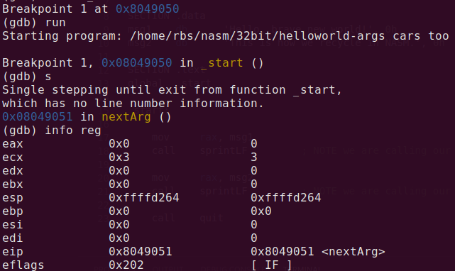
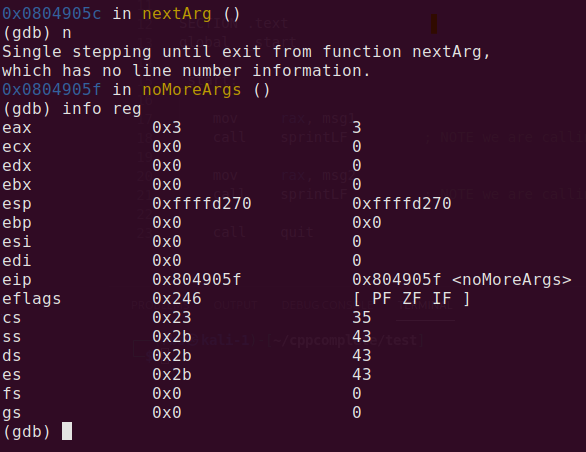
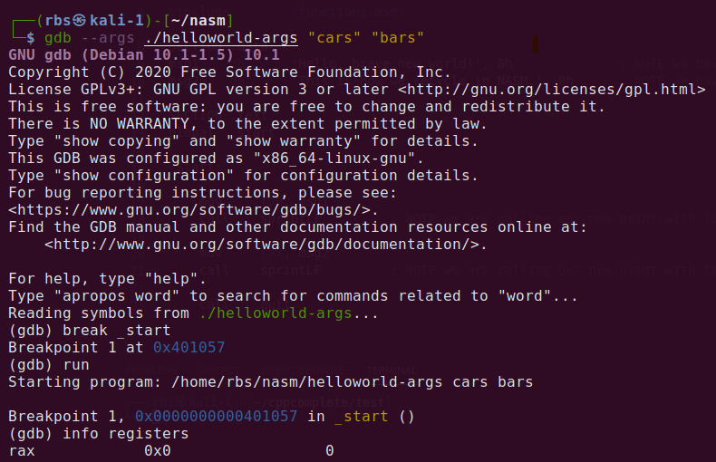
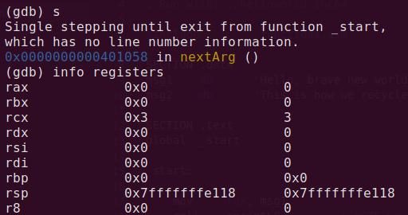
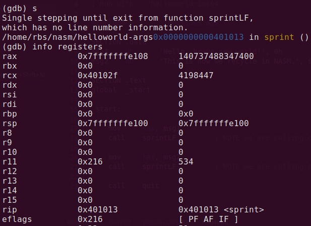

[Lesson 1](#lesson-1) <b>Hello, world!</b>
[Lesson 2](#lesson-2) <b>Proper program exit</b>
[Lesson 3](#lesson-3) <b>Calculate string length</b>
[Lesson 4](#lesson-4) <b>Subroutines</b>
[Lesson 5](#lesson-5) <b>External include files</b>
[Lesson 6](#lesson-6) <b>NULL terminating bytes</b>
[Lesson 7](#lesson-7) <b>Linefeeds</b>

[Lesson 8](#lesson-8) <b>Passing arguments</b>
[Lesson 8-1](#lesson-8-1)<b>Passing arguments 64-bit style</b>
[Lesson 9](#lesson-9) <b>User input</b>
[Lesson 10](#lesson-10) <b>Count to 10</b>
[Lesson 11](#lesson-11) <b>Count to 10 (itoa)</b>
[Lesson 12](#lesson-12) <b>Calculator - addition</b>
[Lesson 13](#lesson-13) <b>Calculator - subtraction</b>
[Lesson 14](#lesson-14) <b>Calculator - multiplication</b>

[Lesson 15](#lesson-15) <b>Calculator - division</b>
[Lesson 16](#lesson-16) <b>Calculator (atoi)</b>
[Lesson 17](#lesson-17) <b>Namespace</b>
[Lesson 18](#lesson-18) <b>Fizz Buzz</b>
[Lesson 19](#lesson-19) <b>Execute Command</b>
[Lesson 20](#lesson-20) <b>Process Forking</b>
[Lesson 21](#lesson-21) <b>Telling the time</b>

[Lesson 22](#lesson-22) <b>File Handling - Create</b>
[Lesson 23](#lesson-23) <b>File Handling - Write</b>
[Lesson 24](#lesson-24) <b>File Handling - Open</b>
[Lesson 25](#lesson-25) <b>File Handling - Read</b>
[Lesson 26](#lesson-26) <b>File Handling - Close</b>
[Lesson 27](#lesson-27) <b>File Handling - Update</b>
[Lesson 28](#lesson-28) <b>File Handling - Delete</b>

[Lesson 29](#lesson-29) <b>Sockets - Create</b>
[Lesson 30](#lesson-30) <b>Sockets - Bind</b>
[Lesson 31](#lesson-31) <b>Sockets - Listen</b>
[Lesson 32](#lesson-32) <b>Sockets - Accept</b>
[Lesson 33](#lesson-33) <b>Sockets - Read</b>
[Lesson 34](#lesson-34) <b>Sockets - Write</b>
[Lesson 35](#lesson-35) <b>Sockets - Close</b>
[Lesson 36](#lesson-36) <b>Download a Webpage</b>

## Lesson 1

Hello, world!

First, some background
Assembly language is bare-bones. The only interface a programmer has above the actual hardware is the kernel itself. In order to build useful programs in assembly we need to use the linux system calls provided by the kernel. These system calls are a library built into the operating system to provide functions such as reading input from a keyboard and writing output to the screen.

When you invoke a system call the kernel will immediately suspend execution of your program. It will then contact the necessary drivers needed to perform the task you requested on the hardware and then return control back to your program.

Note: Drivers are called drivers because the kernel literally uses them to drive the hardware.

We can accomplish this all in assembly by loading RAX (EAX in x86 32-bit) with the function number (operation code OPCODE) we want to execute and filling the remaining registers with the arguments we want to pass to the system call. A software interrupt in 32-bit is requested with the INT instruction and the kernel takes over and calls the function from the library with our arguments. In 64-bit it will use 32 bit registers, so we will need to use syscall interrupt in 64-bit assembly. [Click here to learn more about int 80h and syscall](https://stackoverflow.com/questions/46087730/what-happens-if-you-use-the-32-bit-int-0x80-linux-abi-in-64-bit-code)

For example requesting an interrupt when RAX=60 will call sys_exit and requesting an interrupt when RAX=1 will call sys_write instead. EBX, ECX & EDX is now RBX,RCX, & RDX in 64-bit x64. RBX,RCX, & RDX will be passed as arguments if the function requires them. [Click here to view an example of a 64-bit Linux System Call Table and its corresponding OPCODES.](https://chromium.googlesource.com/chromiumos/docs/+/HEAD/constants/syscalls.md#x86_64-64_bit)

The biggest difference from 32-bit is that after RAX 6 registers get used sequentially as parameters. After that other registers will be put on stack. In 32-bit you could write hello world using RBX register to store stuff in it. In 64-bit we now need to keep in mind the 6 parameters passed by register. Which are RDI,RSI,RDX,RCX,R8, and R9.

Keep in mind I will be using Linux specifically Ubuntu. Depending on your architecture and ABI used these may be called differently. So if using nasm for some other device refer to their documentation, calling tables, and ABI info.

<table>
 <thead>
    <tr>
        <th>Register</th>
        <th>Value</th>
    </tr>
</thead>

<tbody>
    <tr>
        <td>RAX</td>
        <td>System call number</td>
    </tr>
    <tr>
        <td>RDI</td>
        <td>1st argument</td>
    </tr>
    <tr>
        <td>RSI</td>
        <td>2nd argument</td>
    </tr>
    <tr>
        <td>RDX</td>
        <td>3rd argument</td>
    </tr>
    <tr>
        <td>RCX</td>
        <td>4th argument</td>
    </tr>
    <tr>
        <td>R8</td>
        <td>5th argument</td>
    </tr>
    <tr>
        <td>R9</td>
        <td>6th argument</td>
    </tr>
</tbody>
</table>
Writing our program
Firstly we create a variable 'msg' in our .data section and assign it the string we want to output in this case 'Hello, world!'. In our .text section we tell the kernel where to begin execution by providing it with a global label _start: to denote the programs entry point.

We will be using the system call sys_write to output our message to the console window. This function is assigned OPCODE 4 in the x86 Linux System Call Table. In x64 we will user OPCODE 1. The function also takes 3 arguments which are sequentially loaded into RDI, RSI and RDX before requesting a software interrupt which will perform the task.

The arguments passed are as follows:

RDX will be loaded with the length (in bytes) of the string.
RSI will be loaded with the address of our variable created in the .data section.
RDI will be loaded with the file we want to write to – in this case STDOUT.
The datatype and meaning of the arguments passed can be found in the function's definition.
We compile, link and run the program using the commands below.

### Hello World Code

```
; Hello World Program - 64-bit
; Compile with: nasm -f elf64 helloworld.asm
; Link with : ld -m elf_x86_64 helloworld.o -o helloworld
; Run with: ./helloworld
 
SECTION .data
msg     db      'Hello World!', 0Ah     ; assign msg variable with your message string
 
SECTION .text
global  _start
 
_start:
 
    mov     rdx, 13     ; number of bytes to write - one for each letter plus 0Ah (line feed character)
    mov     rsi, msg    ; move the memory address of our message string into ecx
    mov     rdi, 1      ; write to the STDOUT file
    mov     rax, 1      ; invoke SYS_WRITE (kernel opcode 1)
    syscall
```
```
~$ nasm -f elf64 helloworld.asm
~$ ld -m elf_x86_64 helloworld.o -o helloworld
~$ ./helloworld
Hello World!
Segmentation fault
```

## Lesson 2
Proper program exit

Some more background

After successfully learning how to execute a system call in Lesson 1 we now need to learn about one of the most important system calls in the kernel, sys_exit.

Notice how after our 'Hello, world!' program ran we got a Segmentation fault? Well, computer programs can be thought of as a long strip of instructions that are loaded into memory and divided up into sections (or segments). This general pool of memory is shared between all programs and can be used to store variables, instructions, other programs or anything really. Each segment is given an address so that information stored in that section can be found later.

To execute a program that is loaded in memory, we use the global label _start: to tell the operating system where in memory our program can be found and executed. Memory is then accessed sequentially following the program logic which determines the next address to be accessed. The kernel jumps to that address in memory and executes it.

It's important to tell the operating system exactly where it should begin execution and where it should stop. In Lesson 1 we didn't tell the kernel where to stop execution. So, after we called sys_write the program continued sequentially executing the next address in memory, which could have been anything. We don't know what the kernel tried to execute but it caused it to choke and terminate the process for us instead - leaving us the error message of 'Segmentation fault'. Calling sys_exit at the end of all our programs will mean the kernel knows exactly when to terminate the process and return memory back to the general pool thus avoiding an error.

Writing our program
sys_exit has a simple function definition. In the Linux System Call Table it is allocated OPCODE 60 and is passed a single argument through RDI.

In order to execute this function all we need to do is:

Load RDI with 0 to pass zero to the function meaning 'zero errors'.
Load RAX with 60 to call sys_exit.
Then request an interrupt on libc using syscall.
We then compile, link and run it again.

Note: Only new code added in each lesson will be commented.

```
; Hello World Program - asmtutor.com
; Compile with: nasm -f elf64 helloworld.asm
; Link with : ld -m elf_x86_64 helloworld.o -o helloworld
; Run with: ./helloworld
 
SECTION .data
msg     db      'Hello World!', 0Ah
 
SECTION .text
global  _start
 
_start:
 
    mov     rdx, 13
    mov     rsi, msg
    mov     rdi, 1
    mov     rax, 1
    syscall
 
    mov     rdi, 0      ; return 0 status on exit - 'No Errors'
    mov     rax, 60      ; invoke SYS_EXIT (kernel opcode 60)
    syscall

```
```
~$ nasm -f elf64 helloworld.asm
~$ ld -m elf_x86_64 helloworld.o -o helloworld
~$ ./helloworld
Hello World!
```
## Lesson 3
Calculate string length

Firstly, some background

Why do we need to calculate the length of a string?

Well sys_write requires that we pass it a pointer to the string we want to output in memory and the length in bytes we want to print out. If we were to modify our message string we would have to update the length in bytes that we pass to sys_write as well, otherwise it will not print correctly.

You can see what I mean using the program in Lesson 2. Modify the message string to say 'Hello, brave new world!' then compile, link and run the new program. The output will be 'Hello, brave ' (the first 13 characters) because we are still only passing 13 bytes to sys_write as its length. It will be particularly necessary when we want to print out user input. As we won't know the length of the data when we compile our program, we will need a way to calculate the length at runtime in order to successfully print it out.

Writing our program

To calculate the length of the string we will use a technique called pointer arithmetic. Two registers are initialised pointing to the same address in memory. One register (in this case RAX) will be incremented forward one byte for each character in the output string until we reach the end of the string. The original pointer will then be subtracted from RAX. This is effectively like subtraction between two arrays and the result yields the number of elements between the two addresses. This result is then passed to sys_write replacing our hard coded count.

The CMP instruction compares the left hand side against the right hand side and sets a number of flags that are used for program flow. The flag we're checking is the ZF or Zero Flag. When the byte that RAX points to is equal to zero the ZF flag is set. We then use the JZ instruction to jump, if the ZF flag is set, to the point in our program labeled 'finished'. This is to break out of the nextchar loop and continue executing the rest of the program.

```
; Hello World Program (Calculating string length)
; Compile with: nasm -f elf64 helloworld-len64.asm
; Link with : ld -m elf_x86_64 helloworld-len64.o -o helloworld-len64
; Run with: ./helloworld-len

SECTION .data
msg     db      'Hello, brave new world!', 0Ah ; we can modify this now without having to update anywhere else in the program
 
SECTION .text
global  _start
 
_start:
 
    mov     rdi, msg        ; move the address of our message string into RDI
    mov     rax, rdi        ; move the address in RDI into RAX as well (Both now point to the same segment in memory)
 
nextchar:
    cmp     byte [rax], 0   ; compare the byte pointed to by RAX at this address against zero (Zero is an end of string delimiter)
    jz      finished        ; jump (if the zero flagged has been set) to the point in the code labeled 'finished'
    inc     rax             ; increment the address in RAX by one byte (if the zero flagged has NOT been set)
    jmp     nextchar        ; jump to the point in the code labeled 'nextchar'
 
finished:
    sub     rax, rdi        ; subtract the address in RDI from the address in RAX
                            ; remember both registers started pointing to the same address (see line 15)
                            ; but RAX has been incremented one byte for each character in the message string
                            ; when you subtract one memory address from another of the same type
                            ; the result is number of segments between them - in this case the number of bytes
 
    mov     rdx, rax        ; RAX now equals the number of bytes in our string
    mov     rsi, msg        ; the rest of the code should be familiar now
    mov     rdi, 1
    mov     rax, 1
    syscall
 
    mov     rdi, 0
    mov     rax, 60
    syscall

```
```
nasm -f elf64 helloworld-len64.asm
ld -m elf_x86_64 helloworld-len64.o -o helloworld-len64
./helloworld-len64
Hello, brave new world!
```
## Lesson 4 
Subroutines

Introduction to subroutines

Subroutines are functions. They are reusable pieces of code that can be called by your program to perform various repeatable tasks. Subroutines are declared using labels just like we've used before (eg. _start:) however we don't use the JMP instruction to get to them - instead we use a new instruction CALL. We also don't use the JMP instruction to return to our program after we have run the function. To return to our program from a subroutine we use the instruction RET instead.
Why don't we JMP to subroutines?

The great thing about writing a subroutine is that we can reuse it. If we want to be able to use the subroutine from anywhere in the code we would have to write some logic to determine where in the code we had jumped from and where we should jump back to. This would litter our code with unwanted labels. If we use CALL and RET however, assembly handles this problem for us using something called the stack.
Introduction to the stack

The stack is a special type of memory. It's the same type of memory that we've used before however it's special in how it is used by our program. The stack is what is call Last In First Out memory (LIFO). You can think of the stack like a stack of plates in your kitchen. The last plate you put on the stack is also the first plate you will take off the stack next time you use a plate.

The stack in assembly is not storing plates though, its storing values. You can store a lot of things on the stack such as variables, addresses or other programs. We need to use the stack when we call subroutines to temporarily store values that will be restored later.

Any register that your function needs to use should have it's current value put on the stack for safe keeping using the PUSH instruction. Then after the function has finished it's logic, these registers can have their original values restored using the POP instruction. This means that any values in the registers will be the same before and after you've called your function. If we take care of this in our subroutine we can call functions without worrying about what changes they're making to our registers.

The CALL and RET instructions also use the stack. When you CALL a subroutine, the address you called it from in your program is pushed onto the stack. This address is then popped off the stack by RET and the program jumps back to that place in your code. This is why you should always JMP to labels but you should CALL functions.

```
; Hello World Program (Subroutines)
; Compile with: nasm -f elf64 helloworld-len64.asm
; Link with: ld -m elf_x86_64 helloworld-len64.o -o helloworld-len64
; Run with: ./helloworld-len64
 
SECTION .data
msg     db      'Hello, brave new world!', 0Ah
 
SECTION .text
global  _start
 
_start:
 
    mov     rax, msg        ; move the address of our message string into RAX
    call    strlen          ; call our function to calculate the length of the string
 
    mov     rdx, rax        ; our function leaves the result in RAX
    mov     rsi, msg        ; this is all the same as before
    mov     rdi, 1
    mov     rax, 1
    syscall
 
    mov     rdi, 0
    mov     rax, 60
    syscall
 
strlen:                     ; this is our first function declaration
    push    rdi             ; push the value in RDI onto the stack to preserve it while we use RDI in this function
    mov     rdi, rax        ; move the address in RAX into RDI (Both point to the same segment in memory)
 
nextchar:                   ; this is the same as lesson3
    cmp     byte [rax], 0
    jz      finished
    inc     rax
    jmp     nextchar
 
finished:
    sub     rax, rdi
    pop     rdi             ; pop the value on the stack back into RAX
    ret                     ; return to where the function was called
```
```
nasm -f elf64 helloworld-len64.asm
ld -m elf_x86_64 helloworld-len64.o -o helloworld-len64
./helloworld-len64
Hello, brave new world!
```
## Lesson 5 
External include files

External include files allow us to move code from our program and put it into separate files. This technique is useful for writing clean, easy to maintain programs. Reusable bits of code can be written as subroutines and stored in separate files called libraries. When you need a piece of logic you can include the file in your program and use it as if they are part of the same file.

In this lesson we will move our string length calculating subroutine into an external file. We fill also make our string printing logic and program exit logic a subroutine and we will move them into this external file. Once it's completed our actual program will be clean and easier to read.

We can then declare another message variable and call our print function twice in order to demonstrate how we can reuse code.

Note: I won't be showing the code in functions.asm after this lesson unless it changes. It will just be included if needed. 

functions.asm
```
;------------------------------------------
; int slen(String message)
; String length calculation function
slen:
    push    rdi
    mov     rdi, rax
 
nextchar:
    cmp     byte [rax], 0
    jz      finished
    inc     rax
    jmp     nextchar
 
finished:
    sub     rax, rdi
    pop     rdi
    ret
 
 
;------------------------------------------
; void sprint(String message)
; String printing function
sprint:
    push    rdx
    push    rsi
    push    rdi
    push    rax
    call    slen
 
    mov     rdx, rax
    pop     rax
 
    mov     rsi, rax
    mov     rdi, 1
    mov     rax, 1
    syscall
 
    pop     rdi
    pop     rsi
    pop     rdx
    ret
 
 
;------------------------------------------
; void exit()
; Exit program and restore resources
quit:
    mov     rdi, 0
    mov     rax, 60
    syscall
    ret
```
helloworld-inc64.asm
```
; Hello World Program (External file include)
; Compile with: nasm -f elf64 helloworld-inc64.asm
; Link with: ld -m elf_x86_64 helloworld-inc64.o -o helloworld-inc64
; Run with: ./helloworld-inc64
 
%include        'functions.asm'                             ; include our external file
 
SECTION .data
msg1    db      'Hello, brave new world!', 0Ah              ; our first message string
msg2    db      'This is how we recycle in NASM.', 0Ah      ; our second message string
 
SECTION .text
global  _start
 
_start:
 
    mov     rax, msg1       ; move the address of our first message string into RAX
    call    sprint          ; call our string printing function
 
    mov     rax, msg2       ; move the address of our second message string into RAX
    call    sprint          ; call our string printing function
 
    call    quit            ; call our quit function
```
```
nasm -f elf64 helloworld-inc64.asm
ld -m elf_x86_64 helloworld-inc64.o -o helloworld-inc64
./helloworld-inc64
Hello, brave new world!
This is how we recycle in NASM.
This is how we recycle in NASM.
Error: Our second message is outputted twice. This is fixed in the next lesson. 
```

## Lesson 6 
NULL terminating bytes
Ok so why did our second message print twice when we only called our sprint function on msg2 once? Well actually it did only print once. You can see what I mean if you comment out our second call to sprint. The output will be both of our message strings.

But how is this possible?

What is happening is we weren't properly terminating our strings. In assembly, variables are stored one after another in memory so the last byte of our msg1 variable is right next to the first byte of our msg2 variable. We know our string length calculation is looking for a zero byte so unless our msg2 variable starts with a zero byte it keeps counting as if it's the same string (and as far as assembly is concerned it is the same string). So we need to put a zero byte or 0h after our strings to let assembly know where to stop counting.

Note: In programming 0h denotes a null byte and a null byte after a string tells assembly where it ends in memory. 

```
; Hello World Program (External file include)
; Compile with: nasm -f elf64 helloworld-inc64.asm
; Link with: ld -m elf_x86_64 helloworld-inc64.o -o helloworld-inc64
; Run with: ./helloworld-inc64
 
%include        'functions.asm'
 
SECTION .data
msg1    db      'Hello, brave new world!', 0Ah, 0h          ; NOTE the null terminating byte
msg2    db      'This is how we recycle in NASM.', 0Ah, 0h  ; NOTE the null terminating byte
 
SECTION .text
global  _start
 
_start:
 
    mov     rax, msg1
    call    sprint
 
    mov     rax, msg2
    call    sprint
 
    call    quit
```
```
~$ nasm -f elf64 helloworld-inc64.asm
~$ ld -m elf_x86_64 helloworld-inc64.o -o helloworld-inc64
~$ ./helloworld-inc64                                     
Hello, brave new world!
This is how we recycle in NASM.
```
## Lesson 7
Linefeeds

Linefeeds are essential to console programs like our 'hello world' program. They become even more important once we start building programs that require user input. But linefeeds can be a pain to maintain. Sometimes you will want to include them in your strings and sometimes you will want to remove them. If we continue to hard code them in our variables by adding 0Ah after our declared message text, it will become a problem. If there's a place in the code that we don't want to print out the linefeed for that variable we will need to write some extra logic remove it from the string at runtime.

It would be better for the maintainability of our program if we write a subroutine that will print out our message and then print a linefeed afterwards. That way we can just call this subroutine when we need the linefeed and call our current sprint subroutine when we don't.

A call to sys_write requires we pass a pointer to an address in memory of the string we want to print so we can't just pass a linefeed character (0Ah) to our print function. We also don't want to create another variable just to hold a linefeed character so we will instead use the stack.

The way it works is by moving a linefeed character into RAX. We then push RAX onto the stack and get the address pointed to by the Extended Stack Pointer. RSP is another register. When you push items onto the stack, RSP is decremented to point to the address in memory of the last item and so it can be used to access that item directly from the stack. Since RSP points to an address in memory of a character, sys_write will be able to use it to print.

functions.asm
```
;------------------------------------------
; int slen(String message)
; String length calculation function
slen:
    push    rdi
    mov     rdi, rax
 
nextchar:
    cmp     byte [rax], 0
    jz      finished
    inc     rax
    jmp     nextchar
 
finished:
    sub     rax, rdi
    pop     rdi
    ret
 
 
;------------------------------------------
; void sprint(String message)
; String printing function
sprint:
    push    rdx
    push    rsi
    push    rdi
    push    rax
    call    slen
 
    mov     rdx, rax
    pop     rax
 
    mov     rsi, rax
    mov     rdi, 1
    mov     rax, 1
    syscall
 
    pop     rdi
    pop     rsi
    pop     rdx
    ret
 
;------------------------------------------
; void sprintLF(String message)
; String printing with line feed function
sprintLF:
    call    sprint
 
    push    rax         ; push eax onto the stack to preserve it while we use the eax register in this function
    mov     rax, 0Ah    ; move 0Ah into eax - 0Ah is the ascii character for a linefeed
    push    rax         ; push the linefeed onto the stack so we can get the address
    mov     rax, rsp    ; move the address of the current stack pointer into eax for sprint
    call    sprint      ; call our sprint function
    pop     rax         ; remove our linefeed character from the stack
    pop     rax         ; restore the original value of eax before our function was called
    ret                 ; return to our program

;------------------------------------------
; void exit()
; Exit program and restore resources
quit:
    mov     rdi, 0
    mov     rax, 60
    syscall
    ret
```
helloworld-lf.asm
```
; Hello World Program (External file include)
; Compile with: nasm -f elf64 helloworld-lf.asm
; Link with: ld -m elf_x86_64 helloworld-lf.o -o helloworld-lf
; Run with: ./helloworld-inc64
 
%include        'functions.asm'
 
SECTION .data
msg1    db      'Hello, brave new world!', 0h              ; NOTE we have removed the line feed character 0Ah
msg2    db      'This is how we recycle in NASM.', 0h      ; NOTE we have removed the line feed character 0Ah
 
SECTION .text
global  _start
 
_start:
 
    mov     rax, msg1
    call    sprintLF         ; NOTE we are calling our new print with linefeed function
 
    mov     rax, msg2
    call    sprintLF         ; NOTE we are calling our new print with linefeed function
 
    call    quit
```
```
nasm -f elf64 helloworld-lf.asm
ld -m elf_x86_64 helloworld-lf.o -o helloworld-lf
./helloworld-lf
Hello, brave new world!
This is how we recycle in NASM.
```
## Lesson 8
Passing arguments

In x86 we used to be able to use ECX register as our counter for the loop. Although it's a general-purpose register it's original intention was to be used as a counter. Passing arguments to your program from the command line is as easy as popping them off the stack in NASM. When we run our program in x86, any passed arguments are loaded onto the stack in reverse order. The name of the program is then loaded onto the stack and lastly the total number of arguments is loaded onto the stack. The last two stack items for a NASM compiled program are always the name of the program and the number of passed arguments.

So in x86 all we have to do to use them is pop the number of arguments off the stack first, then iterate once for each argument and perform our logic. In our program that means calling our print function.

helloworld-args.asm
```
; Hello World Program (Passing arguments from the command line)
; Compile with: nasm -f elf64 helloworld-args.asm
; Link with: ld -m elf_x86_64 helloworld-args.o -o helloworld-args
; Run with: ./helloworld-args
 
%include        'functions.asm'
 
SECTION .text
global  _start
 
_start:
 
    pop     rcx             ; first value on the stack is the number of arguments
 
nextArg:
    cmp     rcx, 0h         ; check to see if we have any arguments left
    jz      noMoreArgs      ; if zero flag is set jump to noMoreArgs label (jumping over the end of the loop)
    pop     rax             ; pop the next argument off the stack
    call    sprintLF        ; call our print with linefeed function
    dec     rcx             ; decrease rcx (number of arguments left) by 1
    jmp     nextArg         ; jump to nextArg label
 
noMoreArgs:
    call    quit
```
```
~$ nasm -f elf64 helloworld-args.asm
~$ ld -m elf_x86_64 helloworld-args.o -o helloworld-args
~$ ./helloworld-args "This is one argument" "This is another" 101 
./helloworld-args
This is one argument
This is another 101
Error Segmentation Fault
```

If we were to compile the x86 version from Lesson 8 tutorial in asmtutor.com using the nasm -g option we could see the counter gets decremented correctly in GDB. As shown below we start with 3 in ECX. After continously clicking s to step in or n for next in Gdb eventually the program will exit. With ECX showing zero and no segmentation fault.

```
nasm -g -f elf helloworld-args.asm
ld -m elf_i386 helloworld-args.o -o helloworld-args
gdb --args ./helloworld-args "cars" "too"
break _start
run
s
info registers
```




Now if we go back to our 64-bit example and compile it with nasm -g option for debugging we get a segmentation fault. We can see that at first we have 3 in ecx. Our program even prints out the correct stuff. This is due to helloworld-args saving the rcx through pop rcx. However once we get into sprint our code uses a syscall which clobbers the rcx value with a random value. d

```
nasm -g -f elf64 helloworld-args.asm
ld -m elf_x86_64 helloworld-args.o -o helloworld-args
gdb --args ./helloworld-args "cars" "too"
break _start
run
n
info registers
```




Now that rcx has been clobbered the code will run even printing the right arguments. However the code will return back and never hit jz    noMoreArgs The reason being that it will think there are still more arguments left. eventually hitting a segmentation fault while in our functions.asm. [Click here to learn more about syscall clobber](https://peaku.co/questions/20070-%C2%BFcuando-linux-x86-64-syscall-clobber-%25r8%252C-%25r9-y-%25r10) What we know need to do is find a way to print the arguments without relying on RCX. 



```
nasm -g -f elf64 helloworld-args.asm
ld -m elf_x86_64 helloworld-args.o -o helloworld-args
gdb --args ./helloworld-args "cars" "too"
```
## Lesson 8-1
Passing arguments 64-bit style

Seeing that RCX won't work like we could do in x86 using ECX. We need to use a different technique to print out arguments. Since we start without calling syscall we still have RCX holding the amount of arguments. So what we can do is move RCX into a placeholder and clear it when done using it. In this case I have updated the code to use r8. we move RCX in R8 and can now forget about RCX which will get clobbered by SYSCALL (SYSCALL also clobbers r11 register). Keep in mind if r8 was going to be used by other areas of your code you can run into issues. As we can see below it works succesfully.

[This example shows another way we can do this in 64-bit](https://gist.github.com/Gydo194/730c1775f1e05fdca6e9b0c175636f5b)

helloworld-args.asm
```
; Hello World Program (Passing arguments from the command line)
; Compile with: nasm -f elf64 helloworld-args.asm
; Link with: ld -m elf_x86_64 helloworld-args.o -o helloworld-args
; Run with: ./helloworld-args
 
%include        'functions.asm'
 
SECTION .text
global  _start
 
_start:
 
    pop     rcx             ; first value on the stack is the number of arguments
    mov     r8,rcx          ; Since rcx gets clobbered lets move it into r8
 
nextArg:
    cmp     r8, 0h         ; check to see if we have any arguments left
    jz      noMoreArgs      ; if zero flag is set jump to noMoreArgs label (jumping over the end of the loop)
    pop     rax             ; pop the next argument off the stack
    call    sprintLF        ; call our print with linefeed function
    dec     r8             ; decrease rcx (number of arguments left) by 1
    jmp     nextArg         ; jump to nextArg label
 
noMoreArgs:
    call    quit
```
```
~$ nasm -f elf64 helloworld-args.asm
~$ ld -m elf_x86_64 helloworld-args.o -o helloworld-args
~$ ./helloworld-args "This is one argument" "This is another" 101 
./helloworld-args
This is one argument
This is another
101
```
## lesson-9
User input

Introduction to the .bss section

So far we've used the .text and .data section so now it's time to introduce the .bss section. BSS stands for Block Started by Symbol. It is an area in our program that is used to reserve space in memory for uninitialised variables. We will use it to reserve some space in memory to hold our user input since we don't know how many bytes we'll need to store.

The syntax to declare variables is as follows:
.bss section example
```
SECTION .bss
variableName1:      RESB    1       ; reserve space for 1 byte
variableName2:      RESW    1       ; reserve space for 1 word
variableName3:      RESD    1       ; reserve space for 1 double word
variableName4:      RESQ    1       ; reserve space for 1 double precision float (quad word)
variableName5:      REST    1       ; reserve space for 1 extended precision float
```
Writing our program

We will be using the system call sys_read to receive and process input from the user. This function is assigned OPCODE 0 in the Linux System Call Table. Just like sys_write this function also takes 3 arguments which will be loaded into RDX, RSI and RDI before requesting a software interrupt that will call the function.

The arguments passed are as follows:
   - RDX will be loaded with the maximum length (in bytes) of the space in memory.
   - RSI will be loaded with the address of our variable created in the .bss section.
   - RDI will be loaded with the file we want to write to – in this case STDIN.

As always the datatype and meaning of the arguments passed can be found in the function's definition.

When sys_read detects a linefeed, control returns to the program and the users input is located at the memory address you passed in RSI.

helloworld-input.asm
```
; Hello World Program (Getting input)
; Compile with: nasm -f elf64 helloworld-input.asm
; Link with ld -m elf_x86_64 helloworld-input.o -o helloworld-input
; Run with: ./helloworld-input
 
%include        'functions.asm'
 
SECTION .data
msg1        db      'Please enter your name: ', 0h      ; message string asking user for input
msg2        db      'Hello, ', 0h                       ; message string to use after user has entered their name
 
SECTION .bss
sinput:     resb    255                                 ; reserve a 255 byte space in memory for the users input string
 
SECTION .text
global  _start
 
_start:
 
    mov     rax, msg1
    call    sprint
 
    mov     rdx, 255        ; number of bytes to read
    mov     rsi, sinput     ; reserved space to store our input (known as a buffer)
    mov     rdi, 0          ; write to the STDIN file
    mov     rax, 0          ; invoke SYS_READ (kernel opcode 0)
    syscall
 
    mov     rax, msg2
    call    sprint
 
    mov     rax, sinput     ; move our buffer into eax (Note: input contains a linefeed)
    call    sprint          ; call our print function
 
    call    quit
```

## lesson-10
Count to 10

Firstly, some background

Counting by numbers is not as straight forward as you would think in assembly. Firstly we need to pass sys_write an address in memory so we can't just load our register with a number and call our print function. Secondly, numbers and strings are very different things in assembly. Strings are represented by what are called ASCII values. ASCII stands for American Standard Code for Information Interchange. A good reference for ASCII can be found [here](https://www.asciitable.com/). ASCII was created as a way to standardise the representation of strings across all computers.

Remember, we can't print a number - we have to print a string. In order to count to 10 we will need to convert our numbers from standard integers to their ASCII string representations. Have a look at the ASCII values table and notice that the string representation for the number '1' is actually '49' in ASCII. In fact, adding 48 to our numbers is all we have to do to convert them from integers to their ASCII string representations.
Writing our program

What we will do with our program is count from 1 to 10 using the R8 register. We will then add 48 to our counter to convert it from a number to it's ASCII string representation. We will then push this value to the stack and call our print function passing RSP as the memory address to print from. Once we have finished counting to 10 we will exit our counting loop and call our quit function.

helloworld-10.asm
```
; Hello World Program (Count to 10)
; Compile with: nasm -f elf64 helloworld-10.asm
; Link with: ld -m elf_x86_64 helloworld-10.o -o helloworld-10
; Run with: ./helloworld-10
 
%include        'functions.asm'
 
SECTION .text
global  _start
 
_start:
 
    mov     r8, 0          ; r8 is initalised to zero.
 
nextNumber:
    inc     r8             ; increment r8
 
    mov     rax, r8        ; move the address of our integer into rax
    add     rax, 48         ; add 48 to our number to convert from integer to ascii for printing
    push    rax             ; push rax to the stack
    mov     rax, rsp        ; get the address of the character on the stack
    call    sprintLF        ; call our print function
 
    pop     rax             ; clean up the stack so we don't have unneeded bytes taking up space
    cmp     r8, 10         ; have we reached 10 yet? compare our counter with decimal 10
    jne     nextNumber      ; jump if not equal and keep counting
 
    call    quit
```
```
~$ nasm -f elf helloworld-10.asm 
~$ ld -m elf_i386 helloworld-10.o -o helloworld-10 
~$ ./helloworld-10 
1 
2 
3 
4 
5 
6 
7 
8 
9 
:
```
Error: Our number 10 prints a colon (:) character instead. What's going on? 

## lesson-11
Count to 10 (itoa)

So why did our program in Lesson 10 print out a colon character instead of the number 10?. Well lets have a look at our ASCII table. We can see that the colon character has a ASCII value of 58. We were adding 48 to our integers to convert them to their ASCII string representations so instead of passing sys_write the value '58' to print ten we actually need to pass the ASCII value for the number 1 followed by the ASCII value for the number 0. Passing sys_write '4948' is the correct string representation for the number '10'. So we can't just simply add 48 to our numbers to convert them, we first have to divide them by 10 because each place value needs to be converted individually.

We will write 2 new subroutines in this lesson 'iprint' and 'iprintLF'. These functions will be used when we want to print ASCII string representations of numbers. We achieve this by passing the number in RAX. We then initialise a counter in R8. We will repeatedly divide the number by 10 and each time convert the remainder to a string by adding 48. We will then push this onto the stack for later use. Once we can no longer divide the number by 10 we will enter our second loop. In this print loop we will print the now converted string representations from the stack and pop them off. Popping them off the stack moves RSP forward to the next item on the stack. Each time we print a value we will decrease our counter R8. Once all numbers have been converted and printed we will return to our program.

How does the divide instruction work?

The DIV and IDIV instructions work by dividing whatever is in RAX by the value passed to the instruction. The quotient part of the value is left in RAX and the remainder part is put into RDX (Originally called the data register).

For example.
IDIV instruction example
```
mov     rax, 10         ; move 10 into rax
mov     rsi, 10         ; move 10 into rsi
idiv    rsi             ; divide rax by rsi (rax will equal 1 and rdx will equal 0)
idiv    rsi             ; divide rax by rsi again (rax will equal 0 and rdx will equal 1)
```
If we are only storing the remainder won't we have problems?

No, because these are integers, when you divide a number by an even bigger number the quotient in RAX is 0 and the remainder is the number itself. This is because the number divides zero times leaving the original value as the remainder in RDX. How good is that?

Note: Only the new functions iprint and iprintLF have comments. 

functions.asm
```
;------------------------------------------
; void iprint(Integer number)
; Integer printing function (itoa)
iprint:
    push    rax             ; preserve rax on the stack to be restored after function runs
    push    r8             ; preserve r8 on the stack to be restored after function runs
    push    rdx             ; preserve rdx on the stack to be restored after function runs
    push    rsi             ; preserve rsi on the stack to be restored after function runs
    mov     r8, 0          ; counter of how many bytes we need to print in the end
 
divideLoop:
    inc     r8             ; count each byte to print - number of characters
    mov     rdx, 0          ; empty rdx
    mov     rsi, 10         ; mov 10 into rsi
    idiv    rsi             ; divide rax by rsi
    add     rdx, 48         ; convert rdx to it's ascii representation - rdx holds the remainder after a divide instruction
    push    rdx             ; push rdx (string representation of an intger) onto the stack
    cmp     rax, 0          ; can the integer be divided anymore?
    jnz     divideLoop      ; jump if not zero to the label divideLoop
 
printLoop:
    dec     r8             ; count down each byte that we put on the stack
    mov     rax, rsp        ; mov the stack pointer into rax for printing
    call    sprint          ; call our string print function
    pop     rax             ; remove last character from the stack to move esp forward
    cmp     r8, 0          ; have we printed all bytes we pushed onto the stack?
    jnz     printLoop       ; jump is not zero to the label printLoop
 
    pop     rsi             ; restore rsi from the value we pushed onto the stack at the start
    pop     rdx             ; restore rdx from the value we pushed onto the stack at the start
    pop     r8             ; restore r8 from the value we pushed onto the stack at the start
    pop     rax             ; restore rax from the value we pushed onto the stack at the start
    ret
 
 
;------------------------------------------
; void iprintLF(Integer number)
; Integer printing function with linefeed (itoa)
iprintLF:
    call    iprint          ; call our integer printing function
 
    push    rax             ; push rax onto the stack to preserve it while we use the rax register in this function
    mov     rax, 0Ah        ; move 0Ah into rax - 0Ah is the ascii character for a linefeed
    push    rax             ; push the linefeed onto the stack so we can get the address
    mov     rax, esp        ; move the address of the current stack pointer into rax for sprint
    call    sprint          ; call our sprint function
    pop     rax             ; remove our linefeed character from the stack
    pop     rax             ; restore the original value of rax before our function was called
    ret
;------------------------------------------
; int slen(String message)
; String length calculation function
slen:
    push    rdi
    mov     rdi, rax
 
nextchar:
    cmp     byte [rax], 0
    jz      finished
    inc     rax
    jmp     nextchar
 
finished:
    sub     rax, rdi
    pop     rdi
    ret
 
 
;------------------------------------------
; void sprint(String message)
; String printing function
sprint:
    push    rdx
    push    rsi
    push    rdi
    push    rax
    call    slen
 
    mov     rdx, rax
    pop     rax
 
    mov     rsi, rax
    mov     rdi, 1
    mov     rax, 1
    syscall
 
    pop     rdi
    pop     rsi
    pop     rdx
    ret
 
;------------------------------------------
; void sprintLF(String message)
; String printing with line feed function
sprintLF:
    call    sprint
 
    push    rax     
    mov     rax, 0Ah
    push    rax
    mov     rax, rsp
    call    sprint
    pop     rax
    pop     rax
    ret

;------------------------------------------
; void exit()
; Exit program and restore resources
quit:
    mov     rdi, 0
    mov     rax, 60
    syscall
    ret
```
helloworld-itoa.asm
```
; Hello World Program (Count to 10 itoa)
; Compile with: nasm -f elf64 helloworld-itoa.asm
; Link with: ld -m elf_x86_64 helloworld-itoa.o -o helloworld-itoa
; Run with: ./helloworld-itoa

%include        'functions.asm'
 
SECTION .text
global  _start
 
_start:
 
    mov     r8, 0
 
nextNumber:
    inc     r8
    mov     rax, r8
    call    iprintLF        ; NOTE call our new integer printing function (itoa)
    cmp     r8, 10
    jne     nextNumber
 
    call    quit
```
It should now print 1-10 correctly after compile and link
 
## lesson-12
Calculator - addition

In this program we will be adding the registers RAX and RBX together and we'll leave our answer in RAX. Firstly we use the MOV instruction to load RAX with an integer (in this case 90). We then MOV an integer into RBX (in this case 9). Now all we need to do is use the ADD instruction to perform our addition. RBX & RAX will be added together leaving our answer in the left most register in this instruction (in our case RAX). Then all we need to do is call our integer printing function to complete the program.
calculator-addition.asm
```
; Calculator (Addition)
; Compile with: nasm -f elf64 calculator-addition.asm
; Link with: ld -m elf_x86_64 calculator-addition.o -o calculator-addition
; Run with: ./calculator-addition
 
%include        'functions.asm'
 
SECTION .text
global  _start
 
_start:
 
    mov     rax, 90     ; move our first number into rax
    mov     rbx, 9      ; move our second number into rbx
    add     rax, rbx    ; add rbx to rax
    call    iprintLF    ; call our integer print with linefeed function
 
    call    quit
```
After link and compile running it should print out 99
$ ./calculator-addition
99

## lesson-13
Calculator - subtraction
In this program we will be subtracting the value in the register RBX from the value in the register RAX. Firstly we load RAX and RBX with integers in the same way as Lesson 12. The only difference is we will be using the SUB instruction to perform our subtraction logic, leaving our answer in the left most register of this instruction (in our case RAX). Then all we need to do is call our integer printing function to complete the program.
calculator-subtraction.asm
```
; Calculator (Subtraction)
; Compile with: nasm -f elf64 calculator-subtraction.asm
; Link with: ld -m elf_x86_64 calculator-subtraction.o -o calculator-subtraction
; Run with: ./calculator-subtraction
 
%include        'functions.asm'
 
SECTION .text
global  _start
 
_start:
 
    mov     rax, 90     ; move our first number into rax
    mov     rbx, 9      ; move our second number into rbx
    sub     rax, rbx    ; subtract rbx from rax
    call    iprintLF    ; call our integer print with linefeed function
 
    call    quit
```

## lesson-14
Calculator - multiplication
In this program we will be multiplying the value in RBX by the value present in RAX. Firstly we load RAX and RBX with integers in the same way as Lesson 12. This time though we will be calling the MUL instruction to perform our multiplication logic. The MUL instruction is different from many instructions in NASM, in that it only accepts one further argument. The MUL instruction always multiples RAX by whatever value is passed after it. The answer is left in RAX.

calculator-multiplication.asm
```
; Calculator (Multiplication)
; Compile with: nasm -f elf64 calculator-multiplication.asm
; Link with: ld -m elf_x86_64 calculator-multiplication.o -o calculator-multiplication
; Run with: ./calculator-multiplication
 
%include        'functions.asm'
 
SECTION .text
global  _start
 
_start:
 
    mov     rax, 90     ; move our first number into rax
    mov     rbx, 9      ; move our second number into rbx
    mul     rbx         ; multiply rax by rbx
    call    iprintLF    ; call our integer print with linefeed function
 
    call    quit
```
## lesson-15
###Calculator - division

In this program we will be dividing the value in RBX by the value present in RAX. We've used division before in our integer print subroutine. Our program requires a few extra strings in order to print out the correct answer but otherwise there's nothing complicated going on.

Firstly we load RAX and RBX with integers in the same way as Lesson 12. Division logic is performed using the DIV instruction. The DIV instruction always divides RAX by the value passed after it. It will leave the quotient part of the answer in RAX and put the remainder part in RDX (the original data register). We then MOV and call our strings and integers to print out the correct answer.

calculator-division.asm
```
; Calculator (Division)
; Compile with: nasm -f elf64 calculator-division.asm
; Link with: ld -m elf_x86_64 calculator-division.o -o calculator-division
; Run with: ./calculator-division
 
%include        'functions.asm'
 
SECTION .data
msg1        db      ' remainder '      ; a message string to correctly output result
 
SECTION .text
global  _start
 
_start:
 
    mov     rax, 90     ; move our first number into rax
    mov     rbx, 9      ; move our second number into rbx
    div     rbx         ; divide rax by rbx
    call    iprint      ; call our integer print function on the quotient
    mov     rax, msg1   ; move our message string into rax
    call    sprint      ; call our string print function
    mov     rax, rdx    ; move our remainder into rax
    call    iprintLF    ; call our integer printing with linefeed function
 
    call    quit
```

## lesson-16
Calculator (atoi)
Our program will take several command line arguments and add them together printing out the result in the terminal.

### Writing our program

Our program begins by using the POP instruction to get the number of passed arguments off the stack. This value is stored in RCX (originally known as the counter register). It will then POP the next value off the stack containing the program name and remove it from the number of arguments stored in RCX. It will then loop through the rest of the arguments popping each one off the stack and performing our addition logic. As we know, arguments passed via the command line are received by our program as strings. Before we can add the arguments together we will need to convert them to integers otherwise our result will not be correct. We do this by calling our Ascii to Integer function (atoi). This function will convert the ascii value into an integer and place the result in RAX. We can then add this value to EDX (originally known as the data register) where we will store the result of our additions. If the value passed to atoi is not an ascii representation of an integer our function will return zero instead. When all arguments have been converted and added together we will print out the result and call our quit function.

### How does the atoi function work

Converting an ascii string into an integer value is not a trivial task. We know how to convert an integer to an ascii string so the process should essentially work in reverse. Firstly we take the address of the string and move it into RSI (originally known as the source register). We will then move along the string byte by byte (think of each byte as being a single digit or decimal placeholder). For each digit we will check if it's value is between 48-57 (ascii values for the digits 0-9).

Once we have performed this check and determined that the byte can be converted to an integer we will perform the following logic. We will subtract 48 from the value – converting the ascii value to it's decimal equivalent. We will then add this value to RAX (the general purpose register that will store our result). We will then multiple RAX by 10 as each byte represents a decimal placeholder and continue the loop.

When all bytes have been converted we need to do one last thing before we return the result. The last digit of any number represents a single unit (not a multiple of 10) so we have multiplied our result one too many times. We simple divide it by 10 once to correct this and then return. If no integer arguments were pass however, we skip this divide instruction.

### What is the BL register

You may have noticed that the atoi function references the BL register. So far in these tutorials we have been exclusively using 32bit registers. These 32bit general purpose registers contain segments of memory that can also be referenced. These segments are available in 16bits and 8bits. We wanted a single byte (8bits) because a byte is the size of memory that is required to store a single ascii character. If we used a larger memory size we would have copied 8bits of data into 32bits of space leaving us with 'rubbish' bits - because only the first 8bits would be meaningful for our calculation.

The RBX register is 32bits. RBX's 16 bit segment is referenced as BX. BX contains the 8bit segments BL and BH (Lower and Higher bits). We wanted the first 8bits (lower bits) of RBX and so we referenced that storage area using BL.

Almost every assembly language tutorial begins with a history of the registers, their names and their sizes. These tutorials however were written to provide a foundation in NASM by first writing code and then understanding the theory. The full story about the size of registers, their history and importance are beyond the scope of this tutorial but we will return to that story in later tutorials.

Note: Only the new function in this file 'atoi' is shown below. Also functions.asm does have RCX changed to R8 register since 64-bit clobbers RCX in syscalls. However the main calculator-atoi.asm doesn't use syscall until the end when it calls iprintLF, which eventually calls a syscall in functions.asm. This is why I changed ECX to RCX and left it at that, since we would have already pulled our arguments off the stack, and it won't matter anymore that RCX gets clobbered. 

functions.asm
```
;------------------------------------------
; int atoi(Integer number)
; Ascii to integer function (atoi)
atoi:
    push    rbx             ; preserve rbx on the stack to be restored after function runs
    push    r8             ; preserve r8 on the stack to be restored after function runs
    push    rdx             ; preserve rdx on the stack to be restored after function runs
    push    rsi             ; preserve rsi on the stack to be restored after function runs
    mov     rsi, rax        ; move pointer in rax into rsi (our number to convert)
    mov     rax, 0          ; initialise rax with decimal value 0
    mov     r8, 0          ; initialise r8 with decimal value 0
 
.multiplyLoop:
    xor     rbx, rbx        ; resets both lower and uppper bytes of rbx to be 0
    mov     bl, [rsi+r8]   ; move a single byte into rbx register's lower half
    cmp     bl, 48          ; compare rbx register's lower half value against ascii value 48 (char value 0)
    jl      .finished       ; jump if less than to label finished
    cmp     bl, 57          ; compare rbx register's lower half value against ascii value 57 (char value 9)
    jg      .finished       ; jump if greater than to label finished
 
    sub     bl, 48          ; convert rbx register's lower half to decimal representation of ascii value
    add     rax, rbx        ; add rbx to our interger value in rax
    mov     rbx, 10         ; move decimal value 10 into rbx
    mul     rbx             ; multiply rax by rbx to get place value
    inc     r8             ; increment r8 (our counter register)
    jmp     .multiplyLoop   ; continue multiply loop
 
.finished:
    cmp     r8, 0          ; compare r8 register's value against decimal 0 (our counter register)
    je      .restore        ; jump if equal to 0 (no integer arguments were passed to atoi)
    mov     rbx, 10         ; move decimal value 10 into rbx
    div     rbx             ; divide rax by value in rbx (in this case 10)
 
.restore:
    pop     rsi             ; restore rsi from the value we pushed onto the stack at the start
    pop     rdx             ; restore rdx from the value we pushed onto the stack at the start
    pop     r8             ; restore r8 from the value we pushed onto the stack at the start
    pop     rbx             ; restore rbx from the value we pushed onto the stack at the start
    ret
```
calculator-atoi.asm
```
; Calculator (ATOI)
; Compile with: nasm -f elf64 calculator-atoi.asm
;; Link with: ld -m elf_x86_64 calculator-atoi.o -o calculator-atoi
; Run with: ./calculator-atoi 20 1000 317
 
%include        'functions.asm'
 
SECTION .text
global  _start
 
_start:
 
    pop     rcx             ; first value on the stack is the number of arguments
    pop     rdx             ; second value on the stack is the program name (discarded when we initialise rdx)
    sub     rcx, 1          ; decrease rcx by 1 (number of arguments without program name)
    mov     rdx, 0          ; initialise our data register to store additions
 
nextArg:
    cmp     rcx, 0h         ; check to see if we have any arguments left
    jz      noMoreArgs      ; if zero flag is set jump to noMoreArgs label (jumping over the end of the loop)
    pop     rax             ; pop the next argument off the stack
    call    atoi            ; convert our ascii string to decimal integer
    add     rdx, rax        ; perform our addition logic
    dec     rcx             ; decrease rcx (number of arguments left) by 1
    jmp     nextArg         ; jump to nextArg label
 
noMoreArgs:
    mov     rax, rdx        ; move our data result into rax for printing
    call    iprintLF        ; call our integer printing with linefeed function
    call    quit            ; call our quit function
```
```
~$ nasm -f elf64 calculator-atoi.asm
~$ ld -m elf_x86_64 calculator-atoi.o -o calculator-atoi
~$ ./calculator-atoi 20 1000 317
1337
```

## lesson-17 
###Namespace

Namespace is a necessary construct in any software project that involves a codebase that is larger than a few simple functions. Namespace provides scope to your identifiers and allows you to reuse naming conventions to make your code more readable and maintainable. In assembly language where subroutines are identified by global labels, namespace can be achieved by using local labels.

Up until the last few tutorials we have been using global labels exclusively. This means that blocks of logic that essentially perform the same task needed a label with a unique identifier. A good example would be our "finished" labels. These were global in scope meaning when we needed to break out of a loop in one function we could jump to a "finished" label. But if we needed to break out of a loop in a different function we would need to name this same task something else maybe calling it "done" or "continue". Being able to reuse the label "finished" would mean that someone reading the code would know that these blocks of logic perform almost the same task.

Local labels are prepended with a "." at the beginning of their name for example ".finished". You may have noticed them appearing as our code base in functions.asm grew. A local label is given the namespace of the first global label above it. You can jump to a local label by using the JMP instruction and the compiler will calculate which local label you are referencing by determining in what scope (based on the above global labels) the instruction was called.

Note: The file functions.asm was modified adding namespaces in all the subroutines. This is particularly important in the "slen" subroutine which contains a "finished" global label.

Updated functions.asm
```
;------------------------------------------
; int atoi(Integer number)
; Ascii to integer function (atoi)
atoi:
    push    rbx             ; preserve rbx on the stack to be restored after function runs
    push    r8             ; preserve r8 on the stack to be restored after function runs
    push    rdx             ; preserve rdx on the stack to be restored after function runs
    push    rsi             ; preserve rsi on the stack to be restored after function runs
    mov     rsi, rax        ; move pointer in rax into rsi (our number to convert)
    mov     rax, 0          ; initialise rax with decimal value 0
    mov     r8, 0          ; initialise r8 with decimal value 0
 
.multiplyLoop:
    xor     rbx, rbx        ; resets both lower and uppper bytes of rbx to be 0
    mov     bl, [rsi+r8]   ; move a single byte into rbx register's lower half
    cmp     bl, 48          ; compare rbx register's lower half value against ascii value 48 (char value 0)
    jl      .finished       ; jump if less than to label finished
    cmp     bl, 57          ; compare rbx register's lower half value against ascii value 57 (char value 9)
    jg      .finished       ; jump if greater than to label finished
 
    sub     bl, 48          ; convert rbx register's lower half to decimal representation of ascii value
    add     rax, rbx        ; add rbx to our interger value in rax
    mov     rbx, 10         ; move decimal value 10 into rbx
    mul     rbx             ; multiply rax by rbx to get place value
    inc     r8             ; increment r8 (our counter register)
    jmp     .multiplyLoop   ; continue multiply loop
 
.finished:
    cmp     r8, 0          ; compare r8 register's value against decimal 0 (our counter register)
    je      .restore        ; jump if equal to 0 (no integer arguments were passed to atoi)
    mov     rbx, 10         ; move decimal value 10 into rbx
    div     rbx             ; divide rax by value in rbx (in this case 10)
 
.restore:
    pop     rsi             ; restore rsi from the value we pushed onto the stack at the start
    pop     rdx             ; restore rdx from the value we pushed onto the stack at the start
    pop     r8             ; restore r8 from the value we pushed onto the stack at the start
    pop     rbx             ; restore rbx from the value we pushed onto the stack at the start
    ret

;------------------------------------------
; void iprint(Integer number)
; Integer printing function (itoa)
iprint:
    push    rax             ; preserve rax on the stack to be restored after function runs
    push    r8             ; preserve r8 on the stack to be restored after function runs
    push    rdx             ; preserve rdx on the stack to be restored after function runs
    push    rsi             ; preserve rsi on the stack to be restored after function runs
    mov     r8, 0          ; counter of how many bytes we need to print in the end
 
.divideLoop:
    inc     r8             ; count each byte to print - number of characters
    mov     rdx, 0          ; empty rdx
    mov     rsi, 10         ; mov 10 into rsi
    idiv    rsi             ; divide rax by rsi
    add     rdx, 48         ; convert rdx to it's ascii representation - rdx holds the remainder after a divide instruction
    push    rdx             ; push rdx (string representation of an intger) onto the stack
    cmp     rax, 0          ; can the integer be divided anymore?
    jnz     .divideLoop      ; jump if not zero to the label divideLoop
 
.printLoop:
    dec     r8             ; count down each byte that we put on the stack
    mov     rax, rsp        ; mov the stack pointer into rax for printing
    call    sprint          ; call our string print function
    pop     rax             ; remove last character from the stack to move esp forward
    cmp     r8, 0          ; have we printed all bytes we pushed onto the stack?
    jnz     .printLoop       ; jump is not zero to the label printLoop
 
    pop     rsi             ; restore rsi from the value we pushed onto the stack at the start
    pop     rdx             ; restore rdx from the value we pushed onto the stack at the start
    pop     r8             ; restore r8 from the value we pushed onto the stack at the start
    pop     rax             ; restore rax from the value we pushed onto the stack at the start
    ret
 
 
;------------------------------------------
; void iprintLF(Integer number)
; Integer printing function with linefeed (itoa)
iprintLF:
    call    iprint          ; call our integer printing function
 
    push    rax             ; push rax onto the stack to preserve it while we use the rax register in this function
    mov     rax, 0Ah        ; move 0Ah into rax - 0Ah is the ascii character for a linefeed
    push    rax             ; push the linefeed onto the stack so we can get the address
    mov     rax, rsp        ; move the address of the current stack pointer into rax for sprint
    call    sprint          ; call our sprint function
    pop     rax             ; remove our linefeed character from the stack
    pop     rax             ; restore the original value of rax before our function was called
    ret
;------------------------------------------
; int slen(String message)
; String length calculation function
slen:
    push    rdi
    mov     rdi, rax
 
.nextchar:
    cmp     byte [rax], 0
    jz      .finished
    inc     rax
    jmp     .nextchar
 
.finished:
    sub     rax, rdi
    pop     rdi
    ret
 
 
;------------------------------------------
; void sprint(String message)
; String printing function
sprint:
    push    rdx
    push    rsi
    push    rdi
    push    rax
    call    slen
 
    mov     rdx, rax
    pop     rax
 
    mov     rsi, rax
    mov     rdi, 1
    mov     rax, 1
    syscall
 
    pop     rdi
    pop     rsi
    pop     rdx
    ret
 
;------------------------------------------
; void sprintLF(String message)
; String printing with line feed function
sprintLF:
    call    sprint
 
    push    rax     
    mov     rax, 0Ah
    push    rax
    mov     rax, rsp
    call    sprint
    pop     rax
    pop     rax
    ret

;------------------------------------------
; void exit()
; Exit program and restore resources
quit:
    mov     rdi, 0
    mov     rax, 60
    syscall
    ret
```
namespace.asm
```
; Namespace
; Compile with: nasm -f elf64 namespace.asm
; Link with: ld -m elf_x86_64 namespace.o -o namespace
; Run with: ./namespace
 
%include        'functions.asm'
 
SECTION .data
msg1        db      'Jumping to finished label.', 0h        ; a message string
msg2        db      'Inside subroutine number: ', 0h        ; a message string
msg3        db      'Inside subroutine "finished".', 0h     ; a message string
 
SECTION .text
global  _start
 
_start:
 
subrountineOne:
    mov     rax, msg1       ; move the address of msg1 into rax
    call    sprintLF        ; call our string printing with linefeed function
    jmp     .finished       ; jump to the local label under the subrountineOne scope
 
.finished:
    mov     rax, msg2       ; move the address of msg2 into rax
    call    sprint          ; call our string printing function
    mov     rax, 1          ; move the value one into rax (for subroutine number one)
    call    iprintLF        ; call our integer printing function with linefeed function
 
subrountineTwo:
    mov     rax, msg1       ; move the address of msg1 into rax
    call    sprintLF        ; call our string print with linefeed function
    jmp     .finished       ; jump to the local label under the subrountineTwo scope
 
.finished:
    mov     rax, msg2       ; move the address of msg2 into rax
    call    sprint          ; call our string printing function
    mov     rax, 2          ; move the value two into rax (for subroutine number two)
    call    iprintLF        ; call our integer printing function with linefeed function
 
    mov     rax, msg1       ; move the address of msg1 into rax
    call    sprintLF        ; call our string printing with linefeed function
    jmp     finished        ; jump to the global label finished
 
finished:
    mov     rax, msg3       ; move the address of msg3 into rax
    call    sprintLF        ; call our string printing with linefeed function
    call    quit            ; call our quit function
```
```
~$ nasm -f elf64 namespace.asm
~$ ld -m elf_x86_64 namespace.o -o namespace
~$ ./namespace
Jumping to finished label.
Inside subroutine number: 1
Jumping to finished label.
Inside subroutine number: 2
Jumping to finished label.
Inside subroutine "finished".
```

## lesson-18
### Fizz Buzz

Firstly, some background

FizzBuzz is group word game played in schools to teach children division. Players take turns to count aloud integers from 1 to 100 replacing any number divisible by 3 with the word "fizz" and any number divisible by 5 with the word "buzz". Numbers that are both divisible by 3 and 5 are replaced by the word "fizzbuzz". This children's game has also become a defacto interview screening question for computer programming jobs as it's thought to easily discover candidates that can't construct a simple logic gate.

Writing our program

There are a number of code solutions to this simple game and some languages offer very trivial and elegant solutions. Depending on how you choose to solve it, the solution almost always involves an if statement and possibly an else statement depending whether you choose to exploit the mathematical property that anything divisible by 5 & 3 would also be divisible by 3 * 5. Being that this is an assembly language tutorial we will provide a solution that involves a structure of two cascading if statements to print the words "fizz" and/or "buzz" and an else statement in case these fail, to print the integer as an ascii value. Each iteration of our loop will then print a line feed. Once we reach 100 we call our program exit function.

fizzbuzz.asm
```
; Fizzbuzz
; Compile with: nasm -f elf64 fizzbuzz.asm
; Link with: ld -m elf_x86_64 fizzbuzz.o -o fizzbuzz
; Run with: ./fizzbuzz
 
%include        'functions.asm'
 
SECTION .data
fizz        db      'Fizz', 0h     ; a message string
buzz        db      'Buzz', 0h     ; a message string
 
SECTION .text
global  _start
 
_start:
 
    mov     rsi, 0          ; initialise our checkFizz boolean variable
    mov     rdi, 0          ; initialise our checkBuzz boolean variable
    mov     r8, 0          ; initialise our counter variable
 
nextNumber:
    inc     r8             ; increment our counter variable
 
.checkFizz:
    mov     rdx, 0          ; clear the rdx register - this will hold our remainder after division
    mov     rax, r8        ; move the value of our counter into rax for division
    mov     rbx, 3          ; move our number to divide by into rbx (in this case the value is 3)
    div     rbx             ; divide rax by rbx
    mov     rdi, rdx        ; move our remainder into rdi (our checkFizz boolean variable)
    cmp     rdi, 0          ; compare if the remainder is zero (meaning the counter divides by 3)
    jne     .checkBuzz      ; if the remainder is not equal to zero jump to local label checkBuzz
    mov     rax, fizz       ; else move the address of our fizz string into rax for printing
    call    sprint          ; call our string printing function
 
.checkBuzz:
    mov     rdx, 0          ; clear the rdx register - this will hold our remainder after division
    mov     rax, r8        ; move the value of our counter into rax for division
    mov     rbx, 5          ; move our number to divide by into rbx (in this case the value is 5)
    div     rbx             ; divide rax by rbx
    mov     rsi, rdx        ; move our remainder into rdi (our checkBuzz boolean variable)
    cmp     rsi, 0          ; compare if the remainder is zero (meaning the counter divides by 5)
    jne     .checkInt       ; if the remainder is not equal to zero jump to local label checkInt
    mov     rax, buzz       ; else move the address of our buzz string into rax for printing
    call    sprint          ; call our string printing function
 
.checkInt:
    cmp     rdi, 0          ; rdi contains the remainder after the division in checkFizz
    je     .continue        ; if equal (counter divides by 3) skip printing the integer
    cmp     rsi, 0          ; rsi contains the remainder after the division in checkBuzz
    je     .continue        ; if equal (counter divides by 5) skip printing the integer
    mov     rax, r8        ; else move the value in r8 (our counter) into rax for printing
    call    iprint          ; call our integer printing function
 
.continue:
    mov     rax, 0Ah        ; move an ascii linefeed character into rax
    push    rax             ; push the address of rax onto the stack for printing
    mov     rax, rsp        ; get the stack pointer (address on the stack of our linefeed char)
    call    sprint          ; call our string printing function to print a line feed
    pop     rax             ; pop the stack so we don't waste resources
    cmp     r8, 100        ; compare if our counter is equal to 100
    jne     nextNumber      ; if not equal jump to the start of the loop
 
    call    quit            ; else call our quit function
```
```
~$ nasm -f elf64 fizzbuzz.asm
~$ ld -m elf_x86_64 fizzbuzz.o -o fizzbuzz
~$ ./fizzbuzz                             
1
2
Fizz
4
Buzz
Fizz
7
8
Fizz
Buzz
11
Fizz
13
14
FizzBuzz
16
17

```

## lesson-19
Execute Command

Firstly, some background

The EXEC family of functions replace the currently running process with a new process, that executes the command you specified when calling it. We will be using the SYS_EXECVE function in this lesson to replace our program's running process with a new process that will execute the linux program /bin/echo to print out “Hello World!”.

Naming convention

The naming convention used for this family of functions is exec (execute) followed by one or more of the following. https://man7.org/linux/man-pages/man3/exec.3.html shows the convention information. In this case we are using execve which has 3 arguments.

int execve(const char *pathname, char *const argv[],
                  char *const envp[]);
    
    1 - Uses the PATH environment variable to find the file named in the path argument to be executed.
    2 - Command-line arguments are passed to the function as an array of pointers.
    3 - An array of pointers to environment variables is explicitly passed to the new process image.

Writing our program

We will need to pass our arguments in the following format: The first argument is a string containing the command to execute, then an array of arguments to pass to that command and then another array of environment variables that the new process will use. As we are calling a simple command we won't pass any special environment variables to the new process and instead will pass 0h (null). Refer to this https://chromium.googlesource.com/chromiumos/docs/+/master/constants/syscalls.md#x86_64-64_bit . We will need to use system call 59 to call execve. This requires the 3 arguments to be put in the following registers rdi, rsi, and rdx. Also x86 assembly you could use dd size for pointer struct, however in x64 you have to use dq.

Both the command arguments and the environment arguments need to be passed as an array of pointers (addresses to memory). That's why we define our strings first and then define a simple null-terminated struct (array) of the variables names. This is then passed to SYS_EXECVE. We call the function and the process is replaced by our command and output is returned to the terminal.

execute.asm
```
; Execute
; Compile with: nasm -f elf64 execute.asm
; Link with: ld -m elf_x86_64 execute.o -o execute
; Run with: ./execute
 
%include        'functions.asm'
 
SECTION .data
command         db      '/bin/echo', 0h     ; command to execute
arg1            db      'Hello World!', 0h
arguments       dq      command
                dq      arg1                ; arguments to pass to commandline (in this case just one)
                dq      0h                  ; end the struct
environment     dq      0h                  ; arguments to pass as environment variables (inthis case none) end the struct
 
SECTION .text
global  _start
 
_start:
 
    mov     rdx, environment    ; address of environment variables
    mov     rsi, arguments      ; address of the arguments to pass to the commandline
    mov     rdi, command        ; address of the file to execute
    mov     rax, 59             ; invoke SYS_EXECVE (kernel opcode 59)
    syscall
 
    call    quit                ; call our quit function
```
Note: Here are a couple other commands to try.

execute.asm
```
SECTION .data
command         db      '/bin/ls', 0h       ; command to execute
arg1            db      '-l', 0h
```
execute.asm
```
SECTION .data
command         db      '/bin/sleep', 0h    ; command to execute
arg1            db      '5', 0h
```
## lesson-20
Process Forking

Firstly, some background

In this lesson we will use SYS_FORK to create a new process that duplicates our current process. SYS_FORK takes no arguments - you just call fork and the new process is created. Both processes run concurrently. We can test the return value (in rax) to test whether we are currently in the parent or child process. The parent process returns a non-negative, non-zero integer. In the child process RAX is zero. This can be used to branch your logic between the parent and child.

In our program we exploit this fact to print out different messages in each process.

Note: Each process is responsible for safely exiting. 

fork.asm
```
; Fork
; Compile with: nasm -f elf64  fork.asm
; Link with: ld -m elf_x86_64 fork.o -o fork
; Run with: ./fork
 
%include        'functions.asm'
 
SECTION .data
childMsg        db      'This is the child process', 0h     ; a message string
parentMsg       db      'This is the parent process', 0h    ; a message string
 
SECTION .text
global  _start
 
_start:
 
    mov     rax, 57              ; invoke SYS_FORK (kernel opcode 57)
    syscall
 
    cmp     rax, 0              ; if rax is zero we are in the child process
    jz      child               ; jump if rax is zero to child label
 
parent:
    mov     rax, parentMsg      ; inside our parent process move parentMsg into rax
    call    sprintLF            ; call our string printing with linefeed function
 
    call    quit                ; quit the parent process
 
child:
    mov     rax, childMsg       ; inside our child process move childMsg into rax
    call    sprintLF            ; call our string printing with linefeed function
 
    call    quit                ; quit the child process
```

## lesson-21
Telling the time

Generating a unix timestamp in NASM is easy with the SYS_TIME function of the linux kernel. Simply pass OPCODE 200 to the kernel with no arguments and you are returned the Unix Epoch in the EAX register.

That is the number of seconds that have elapsed since January 1st 1970 UTC.

time.asm
```
; Time
; Compile with: nasm -f elf64 time.asm
; Link with: ld -m elf_x86_64 time.o -o time
; Run with: ./time
 
%include        'functions.asm'
 
SECTION .data
msg        db      'Seconds since Jan 01 1970: ', 0h     ; a message string
 
SECTION .text
global  _start
 
_start:
 
    mov     rax, msg        ; move our message string into rax for printing
    call    sprint          ; call our string printing function
 
    mov     rax, 200        ; invoke SYS_TIME (kernel opcode 200)
    syscall                 ; call the kernel
 
    call    iprintLF        ; call our integer printing function with linefeed
    call    quit            ; call our quit function
```

## lesson-22
File Handling - Create
Firstly, some background

File Handling in Linux is achieved through a small number of system calls related to creating, updating and deleting files. These functions require a file descriptor which is a unique, non-negative integer that identifies the file on the system.
Writing our program

We begin the tutorial by creating a file using sys_creat. We will then build upon our program in each of the following file handling lessons, adding code as we go. Eventually we will have a full program that can create, update, open, close and delete files.

sys_creat expects 2 arguments - the file permissions in RSI and the filename in RDI. The sys_creat opcode is then loaded into RAX and the kernel is called to create the file. The file descriptor of the created file is returned in RAX. This file descriptor can then be used for all other file handling functions.

create.asm
```
; Create
; Compile with: nasm -f elf64 create.asm
; Link with: ld -m elf_x86_64 create.o -o create
; Run with: ./create
 
%include    'functions.asm'
 
SECTION .data
filename db 'readme.txt', 0h    ; the filename to create
 
SECTION .text
global  _start
 
_start:
 
    mov     rsi, 0777o          ; set all permissions to read, write, execute
    mov     rdi, filename       ; filename we will create
    mov     rax, 85              ; invoke SYS_CREAT (kernel opcode 85)
    syscall                     ; call the kernel
 
    call    quit                ; call our quit function
```
## lesson-23
File Handling - Write

Building upon the previous lesson we will now use sys_write to write content to a newly created file.

sys_write expects 3 arguments - the number of bytes to write in RDX, the contents string to write in RSI and the file descriptor in RDI. The sys_write opcode is then loaded into RAX and the kernel is called to write the content to the file. In this lesson we will first call sys_creat to get a file descriptor which we will then load into RDI.

write.asm
```
; Write
; Compile with: nasm -f elf64  write.asm
; Link with: ld -m elf_x86_64 write.o -o write
; Run with: ./write
 
%include    'functions.asm'
 
SECTION .data
filename db 'readme.txt', 0h    ; the filename to create
contents db 'Hello world!', 0h  ; the contents to write
 
SECTION .text
global  _start
 
_start:
 
    mov     rsi, 0777o          ; code continues from lesson 22
    mov     rdi, filename
    mov     rax, 85
    syscall
 
    mov     rdx, 12             ; number of bytes to write - one for each letter of our contents string
    mov     rsi, contents       ; move the memory address of our contents string into rsi
    mov     rdi, rax            ; move the file descriptor of the file we created into rdi
    mov     rax, 1              ; invoke SYS_WRITE (kernel opcode 1)
    syscall                     ; call the kernel
 
    call    quit                ; call our quit function
```
After compiling and running. Cat command will show the contents of file
```
$ nasm -f elf64  write.asm
$ ld -m elf_x86_64 write.o -o write 
$ ./write                           
$ cat readme.txt 
Hello world!
```

## lesson-24
File Handling - Open

Building upon the previous lesson we will now use sys_open to obtain the [file descriptor](https://en.wikipedia.org/wiki/File_descriptor) of the newly created file. This file descriptor can then be used for all other file handling functions.

sys_open expects 2 arguments - the access mode (table below) in RSI and the filename in RDI. The sys_open opcode is then loaded into RAX and the kernel is called to open the file and return the file descriptor.

sys_open additionally accepts zero or more file creation flags and file status flags in RDX. [Click here for more information about the access mode, file creation flags and file status flags.](https://man7.org/linux/man-pages/man2/open.2.html)
	Description 	Value
- O_RDONLY 	open file in read only mode 	0
- O_WRONLY 	open file in write only mode 	1
- O_RDWR 	open file in read and write mode 	2

Note: sys_open returns the file descriptor in RAX. On linux this will be a unique, non-negative integer which we will print using our integer printing function. 

open.asm
```
; Open
; Compile with: nasm -f elf64 open.asm
; Link with: ld -m elf_x86_64 open.o -o open
; Run with: ./open
 
%include    'functions.asm'
 
SECTION .data
filename db 'readme.txt', 0h    ; the filename to create
contents db 'Hello world!', 0h  ; the contents to write
 
SECTION .text
global  _start
 
_start:
 
    mov     rsi, 0777o          ; Create file from lesson 22
    mov     rdi, filename
    mov     rax, 85
    syscall
 
    mov     rdx, 12             ; Write contents to file from lesson 23
    mov     rsi, contents
    mov     rdi, rax
    mov     rax, 1
    syscall
 
    mov     rsi, 0              ; flag for readonly access mode (O_RDONLY)
    mov     rdi, filename       ; filename we created above
    mov     rax, 2              ; invoke SYS_OPEN (kernel opcode 2)
    syscall                     ; call the kernel
 
    call    iprintLF            ; call our integer printing function
    call    quit                ; call our quit function
```
## lesson-25
File Handling - Read

Building upon the previous lesson we will now use sys_read to read the content of a newly created and opened file. We will store this string in a variable.

sys_read expects 3 arguments - the number of bytes to read in RDX, the memory address of our variable in RSI and the [file descriptor](https://en.wikipedia.org/wiki/File_descriptor) in RDI. We will use the previous lessons sys_open code to obtain the file descriptor which we will then load into RDI. The sys_read opcode is then loaded into RAX and the kernel is called to read the file contents into our variable and is then printed to the screen.

Note: We will reserve 255 bytes in the .bss section to store the contents of the file. [See Lesson 9 for more information on the .bss section.](#lesson-9) 

read.asm
```
; Read
; Compile with: nasm -f elf64 read.asm
; Link with: ld -m elf_x86_64 read.o -o read
; Run with: ./read
 
%include    'functions.asm'
 
SECTION .data
filename db 'readme.txt', 0h    ; the filename to create
contents db 'Hello world!', 0h  ; the contents to write

SECTION .bss
fileContents resb 255,          ; variable to store file contents

SECTION .text
global  _start
 
_start:
 
    mov     rsi, 0777o          ; Create file from lesson 22
    mov     rdi, filename
    mov     rax, 85
    syscall
 
    mov     rdx, 12             ; Write contents to file from lesson 23
    mov     rsi, contents
    mov     rdi, rax
    mov     rax, 1
    syscall
 
    mov     rsi, 0              ; Open file from lesson 24
    mov     rdi, filename
    mov     rax, 2
    syscall
 
    mov     rdx, 12             ; number of bytes to read - one for each letter of the file contents
    mov     rsi, fileContents   ; move the memory address of our file contents variable into rsi
    mov     rdi, rax            ; move the opened file descriptor into rdi
    mov     rax, 0              ; invoke SYS_READ (kernel opcode 0)
    syscall                     ; call the kernel
 
    mov     rax, fileContents   ; move the memory address of our file contents variable into rax for printing
    call    sprintLF            ; call our string printing function
 
    call    quit                ; call our quit function
```
## lesson-26
File Handling - Close

Building upon the previous lesson we will now use sys_close to properly close an open file.

sys_close expects 1 argument - the file descriptor in RDI. We will use the previous lessons code to obtain the file descriptor which we will then load into RDI. The sys_close opcode is then loaded into RAX and the kernel is called to close the file and remove the active file descriptor.

close.asm
```
; Close
; Compile with: nasm -f elf64 close.asm
; Link with: ld -m elf_x86_64 close.o -o close
; Run with: ./close
 
%include    'functions.asm'
 
SECTION .data
filename db 'readme.txt', 0h    ; the filename to create
contents db 'Hello world!', 0h  ; the contents to write

SECTION .bss
fileContents resb 255,          ; variable to store file contents

SECTION .text
global  _start
 
_start:
 
    mov     rsi, 0777o          ; Create file from lesson 22
    mov     rdi, filename
    mov     rax, 85
    syscall
 
    mov     rdx, 12             ; Write contents to file from lesson 23
    mov     rsi, contents
    mov     rdi, rax
    mov     rax, 1
    syscall
 
    mov     rsi, 0              ; Open file from lesson 24
    mov     rdi, filename
    mov     rax, 2
    syscall
 
    mov     rdx, 12             ; Read file from lesson 25
    mov     rsi, fileContents
    mov     rdi, rax
    mov     rax, 0
    syscall                     
 
    mov     rax, fileContents
    call    sprintLF
 
    mov     rdi, rdi            ; not needed but used to demonstrate that SYS_CLOSE takes a file descriptor from rdi
    mov     rax, 3              ; invoke SYS_CLOSE (kernel opcode 3)
    syscall                     ; call the kernel
 
    call    quit                ; call our quit function
```

## lesson-27
File Handling - Seek

In this lesson we will open a file and update the file contents at the end of the file using sys_lseek.

Using sys_lseek you can move the cursor within the file by an offset in bytes. The below example will move the cursor to the end of the file, then pass 0 bytes as the offset (so we append to the end of the file and not beyond) before writing a string in that position. Try different values in RSI and RDX to write the content to different positions within the opened file.

sys_lseek expects 3 arguments - the whence argument (table below) in RDX, the offset in bytes in RSI, and the file descriptor in RDI. The sys_lseek opcode is then loaded into RAX and we call the kernel to move the file pointer to the correct offset. We then use sys_write to update the content at that position.
	
<table>
                                    <thead>
                                        <tr>
                                            <th>Whence</th>
                                            <th>Description</th>
                                            <th>Value</th>
                                        </tr>
                                    </thead>
                                    <tbody>
                                        <tr>
                                            <td><b>SEEK_SET</b></td>
                                            <td>beginning of the file</td>
                                            <td>0</td>
                                        </tr>
                                        <tr>
                                            <td><b>SEEK_CUR</b></td>
                                            <td>current file offset</td>
                                            <td>1</td>
                                        </tr>
                                        <tr>
                                            <td><b>SEEK_END</b></td>
                                            <td>end of the file</td>
                                            <td>2</td>
                                        </tr>
                                    </tbody>
                                </table>

Note: A file 'readme.txt' has been included in the code folder for this lesson. This file will be updated after running the program. You could also use the helloworld readme.txt from earlier lessons, or make your own readme.txt file.

seek.asm
```
; Seek
; Compile with: nasm -f elf64 seek.asm
; Link with: ld -m elf_x86_64 seek.o -o seek
; Run with: ./seek
 
%include    'functions.asm'
 
SECTION .data
filename db 'readme.txt', 0h    ; the filename to create
contents  db '-updated-', 0h     ; the contents to write at the start of the file
 
SECTION .text
global  _start
 
_start:
 
    mov     rsi, 1              ; flag for writeonly access mode (O_WRONLY)
    mov     rdi, filename       ; filename of the file to open
    mov     rax, 2              ; invoke SYS_OPEN (kernel opcode 2)
    syscall                     ; call the kernel
 
    mov     rdx, 2              ; whence argument (SEEK_END)
    mov     rsi, 0              ; move the cursor 0 bytes
    mov     rdi, rax            ; move the opened file descriptor into rdi
    mov     rax, 8             ; invoke SYS_LSEEK (kernel opcode 8)
    syscall                     ; call the kernel
 
    mov     rdx, 9              ; number of bytes to write - one for each letter of our contents string
    mov     rsi, contents       ; move the memory address of our contents string into rsi
    mov     rdi, rdi            ; move the opened file descriptor into rdi (not required as rdi already has the FD)
    mov     rax, 1              ; invoke SYS_WRITE (kernel opcode 1)
    syscall                     ; call the kernel
 
    call    quit                ; call our quit function
```
## lesson-28
File Handling - Delete

Deleting a file on linux is achieved by calling sys_unlink.

sys_unlink expects 1 argument - the filename in RDI. The sys_unlink opcode is then loaded into RAX and the kernel is called to delete the file.

Note: A file 'readme.txt' has been included in the code folder for this lesson. This file will be deleted after running the program. 

unlink.asm
```
; Unlink
; Compile with: nasm -f elf64 unlink.asm
; Link with: ld -m elf_x86_64 unlink.o -o unlink
; Run with: ./unlink
 
%include    'functions.asm'
 
SECTION .data
filename db 'readme.txt', 0h    ; the filename to delete
 
SECTION .text
global  _start
 
_start:
 
    mov     rdi, filename       ; filename we will delete
    mov     rax, 87             ; invoke SYS_UNLINK (kernel opcode 87)
    syscall                     ; call the kernel
 
    call    quit                ; call our quit function
```
## lesson-29
Sockets - Create
Firstly, some background

Socket Programming in Linux is achieved through the use of the SYS_SOCKETCALL kernel function. The SYS_SOCKETCALL function is somewhat unique in that it encapsulates a number of different subroutines, all related to socket operations, within the one function. By passing different integer values in EBX we can change the behaviour of this function to create, listen, send, receive, close and more. [Click here]() to view the full commented source code of the completed program in x86. These tutorials are for x64 assembly so we wo;; use SYS_SOCKET instead more information on it can be found [here]()

Writing our program

We begin the tutorial by first initalizing some of our registers which we will use later to store important values. We will then create a socket using the 3 parameters SYS_SOCKET require. We will then build upon our program in each of the following socket programming lessons, adding code as we go. Eventually we will have a full program that can create, bind, listen, accept, read, write and close sockets.

SYS_SOCKETCALL expects 3 arguments - a domain in RDI in this case we will use AF_INET for IPv4 communication. Next we will specify the type in RSI, which will be 1 for SOCK_STREAM. Finally the third parameter is the protocol which matches up the the RFC 791 numbers for IPv4. In this case for TCP it is the number 6 to be stored into the RDX register. More info on the numbers can be [found here]()  Finally the SYS_SOCKET opcode 41 is then loaded into RAX and the kernel is called to create the socket. Because everything in linux is a file, we recieve back the file descriptor of the created socket in RAX. This file descriptor can then be used for performing other socket programming functions.

Note: XORing a register by itself is an efficent way of ensuring the register is initalised with the integer value zero and doesn't contain an unexpected value that could corrupt your program. 

socket.asm
```
; Socket
; Compile with: nasm -f elf64 socket.asm
; Link with: ld -m elf_x86_64 socket.o -o socket
; Run with: ./socket
 
%include    'functions.asm'
 
SECTION .text
global  _start
 
_start:
 
    xor     rax, rax            ; init rax 0
    xor     rdx, rdx            ; init rbx 0
    xor     rdi, rdi            ; init rdi 0
    xor     rsi, rsi            ; init rsi 0
 
_socket:
 
    mov     rdi, 3              ; move 3 into rdi for domain (AF_NET)
    mov     rsi, 1              ; move 1 into rsi for type (SOCK_STREAM)
    mov     rdx, 6              ; move into rdx for protocol 6 TCP (IPPROTO_TCP)
    mov     rax, 41             ; invoke SYS_SOCKET (kernel opcode 41)
    syscall                     ; call the kernel
 
    call    iprintLF            ; call our integer printing function (print the file descriptor in rax or -1 on error)
 
_exit:
 
    call    quit                ; call our quit function
```
## lesson-30
Sockets - Bind

Building on the previous lesson we will now associate the created socket with a local IP address and port which will allow us to connect to it. We do this by calling the bind syscall 49.

We begin by storing the file descriptor we recieved in lesson 29 into RDI. RDI which in x86 is called EDI was originally called the Destination Index and is traditionally used in copy routines to store the location of a target file.

SYS_BIND requires 3 parameters. RDI which will store the file descriptor. RSI which requires a structure in struct sockaddr* format. RDX stores the size. The structure for the second parameter addr will depend on the address family. If you want to find out more info about bind [click here](https://man7.org/linux/man-pages/man2/bind.2.html). In this case we are using TCP/IP protocol 6. Finally The SYS_BIND opcode 49 is then loaded into RAX and the kernel is called to bind the socket. Also we have to save our parent fd, becuase in our next lessons fork will open a new file descriptor for future connections. This will create a situation where exiting the child process won't necessarily keep the parent file descriptor saved. So to fix this we store it in r9 register.

socket.asm
```
; Socket
; Compile with: nasm -f elf64 socket.asm
; Link with: ld -m elf_x86_64 socket.o -o socket
; Run with: ./socket
 
%include    'functions.asm'
 
SECTION .text
global  _start
 
_start:
 
    xor     rax, rax            ; initialize some registers
    xor     rdx, rdx
    xor     rdi, rdi
    xor     rsi, rsi
 
_socket:
 
    mov     rdi, 2              ; create socket from lesson 29
    mov     rsi, 1
    mov     rdx, 0
    mov     rax, 41
    syscall

_bind:
 
    mov     rdi, rax            ; move return value of SYS_SOCKET into rdi (file descriptor for new socket, or -1 on error)
    push    dword 0x00000000    ; push 0 dec onto the stack IP ADDRESS (0.0.0.0)
    push    word 0x2923         ; push 9001 dec onto stack PORT (reverse byte order)
    push    word 2              ; push 2 dec onto stack AF_INET
    mov     r9, rdi             ; store rdi in r9 to save parent file descriptor
    mov     rsi, rsp            ; move address of stack pointer into rsi
    add     rdx, 16             ; push 16 dec into rdx for size (arguments length)
    mov     rax, 49             ; invoke SYS_BIND (kernel opcode 49)
    syscall                     ; call the kernel

_exit:
 
    call    quit                ; call our quit function
```
## lesson-31
Sockets - Listen
In the previous lessons we created a socket and used 'bind' to associate it with a local IP address and port. In this lesson we will use the sys_listen systemcall to tell our socket to listen for incoming TCP requests. This will allow us to read and write to anyone who connects to our socket.

SYS_LISTEN expects 2 arguments - sockfd which is a file descriptor in RDI and the backlog integer in RSI. More info on the syscall can be found [here](https://man7.org/linux/man-pages/man2/listen.2.html) We will pass our file descriptor to RDI. Next put value 4 RSI for the backlog queue. The SYS_LISTEN opcode is then loaded into RAX and the kernel is called. If succesful the socket will begin listening for incoming requests.

socket.asm
```
; Socket
; Compile with: nasm -f elf64 socket.asm
; Link with: ld -m elf_x86_64 socket.o -o socket
; Run with: ./socket
 
%include    'functions.asm'
 
SECTION .text
global  _start
 
_start:
 
    xor     rax, rax            ; initialize some registers
    xor     rdx, rdx
    xor     rdi, rdi
    xor     rsi, rsi
 
_socket:
 
    mov     rdi, 2              ; create socket from lesson 29
    mov     rsi, 1
    mov     rdx, 0
    mov     rax, 41
    syscall

_bind:
 
    mov     rdi, rax            ; bind socket from lesson 30
    push    dword 0x00000000
    push    word 0x2923
    push    word 2
    mov     r9, rdi
    mov     rsi,rsp
    add     rdx, 16
    mov     rax, 49
    syscall

_listen:
    mov     rsi, 4              ; rdi is already set from _socket and _bind. So set backlog arg (4)
    mov     rax, 50             ; invoke SYS_LISTEN (kernel opcode 50)
    syscall                     ; call the kernel

_exit:
 
    call    quit                ; call our quit function
```
## lesson-32
Sockets - Accept
In the previous lessons we created a socket and used the SYS_BIND syscall to associate it with a local IP address and port. We then used the SYS_LISTEN syscall to tell our socket to listen for incoming TCP requests. Now we will use the SYS_ACCEPT syscall to tell our socket to accept those incoming requests. Our socket will then be ready to read and write to remote connections.

SYS_ACCEPT's syscall expects 3 arguments - A file descriptor sockfd in RDI. A pointer *addr to a structure in RSI. And the length addrLen in RDX. The SYS_ACCEPT opcode 43 is then loaded into RAX and the kernel is called. Note earlier in our lessons we created the structure as an array in RSI. This time we can reuse the values in RSI and RDI (rdi file descriptor). The 'accept' syscall will create another file descriptor, this time identifying the incoming socket connection. We will later use this file descriptor to read and write to the incoming connection in later lessons. In x64 we have to store the file descriptor that 'accept' creates elsewhere. In this case we store RDI in R9 

Note: Run the program and use the command sudo netstat -plnt in another terminal to view the socket listening on port 9001. 

socket.asm
```
; Socket
; Compile with: nasm -f elf64 socket.asm
; Link with: ld -m elf_x86_64 socket.o -o socket
; Run with: ./socket
 
%include    'functions.asm'
 
SECTION .text
global  _start
 
_start:
 
    xor     rax, rax            ; initialize some registers
    xor     rdx, rdx
    xor     rdi, rdi
    xor     rsi, rsi
 
_socket:
 
    mov     rdi, 2              ; create socket from lesson 29
    mov     rsi, 1
    mov     rdx, 0
    mov     rax, 41
    syscall

_bind:
 
    mov     rdi, rax            ; bind socket from lesson 30
    push    dword 0x00000000
    push    word 0x2923
    push    word 2
    mov     r9, rdi
    mov     rsi,rsp
    add     rdx, 16
    mov     rax, 49
    syscall

_listen:
    mov     rsi, 4              ; bind socket from lesson 31
    mov     rax, 50
    syscall

_accept:
    xor     rsi, rsi            ; clear rsi
    mov     rdi, r9             ; r9 which has parent fd put into rdi. prevents fork loop error
    mov     rdx, rsi            ; accept socket from lesson 32
    mov     rax, 43
    syscall                     ; call the kernel

_exit:
 
    call    quit                ; call our quit function
```

## lesson-33
Sockets - Read

When an incoming connection is accepted by our socket, a new file descriptor identifying the incoming socket connection is returned in RAX. In this lesson we will use this file descriptor to read the incoming request headers from the connection.

We begin by storing the file descriptor we recieved in lesson 32 into RDI. ESI was originally called the Source Index and is traditionally used in copy routines to store the location of a target file. In the 32-bit code we would have used ESI. ESI is RSI in 64-bit however it is used as argument 1. In earlier lessons we stored the parent fd in register R9, so using RDI in fork will be fine.

We will use the kernel function sys_read to read from the incoming socket connection. As we have done in previous lessons, we will create a variable to store the contents being read from the file descriptor. Our socket will be using the HTTP protocol to communicate. Parsing HTTP request headers to determine the length of the incoming message and accepted response formats is beyond the scope of this tutorial. We will instead just read up to the first 255 bytes and print that to standardout.

Once the incoming connection has been accepted, it is very common for webservers to spawn a child process to manage the read/write communication. The parent process is then free to return to the listening/accept state and accept any new incoming requests in parallel. We will implement this design pattern below using SYS_FORK and the JMP instruction prior to reading the request headers in the child process.

To generate valid request headers we will use the commandline tool curl to connect to our listening socket. But you can also use a standard web browser to connect in the same way.

sys_read expects 3 arguments - the number of bytes to read in RDX, the memory address of our variable in RSI and the file descriptor in RDI. The sys_read opcode is then loaded into RAX and the kernel is called to read the contents into our variable which is then printed to the screen.

Note: We will reserve 255 bytes in the .bss section to store the contents being read from the file descriptor. See Lesson 9 for more information on the .bss section.

Note: Run the program and use the command curl http://localhost:9001 in another terminal to view the request headers being read by our program.

socket.asm
```
; Socket
; Compile with: nasm -f elf64 socket.asm
; Link with: ld -m elf_x86_64 socket.o -o socket
; Run with: ./socket
 
%include    'functions.asm'

SECTION .bss
buffer resb 255,                ; variable to store request headers
 
SECTION .text
global  _start

_start:
 
    xor     rax, rax            ; initialize some registers
    xor     rdx, rdx
    xor     rdi, rdi
    xor     rsi, rsi
 
_socket:
 
    mov     rdi, 2              ; create socket from lesson 29
    mov     rsi, 1
    mov     rdx, 0
    mov     rax, 41
    syscall

_bind:
 
    mov     rdi, rax            ; bind socket from lesson 30
    push    dword 0x00000000
    push    word 0x2923
    push    word 2
    mov     r9, rdi
    mov     rsi,rsp
    add     rdx, 16
    mov     rax, 49
    syscall

_listen:
    mov     rsi, 4              ; bind socket from lesson 31
    mov     rax, 50
    syscall

_accept:
    xor     rsi, rsi            ; accept socket from lesson 32
    mov     rdi, r9
    mov     rdx, rsi
    mov     rax, 43
    syscall
    
_fork:
 
    mov     rdi, rax            ; move return value of SYS_SOCKET into rdi (file descriptor for accepted socket, or -1 on error)
    mov     rax, 57             ; invoke SYS_FORK (kernel opcode 57)
    syscall                     ; call the kernel
 
    cmp     rax, 0              ; if return value of SYS_FORK in rax is zero we are in the child process
    jz      _read               ; jmp in child process to _read
 
    jmp     _accept             ; jmp in parent process to _accept
 
_read:
    mov     rdx, 255            ; number of bytes to read (we will only read the first 255 bytes for simplicity)
    mov     rsi, buffer         ; move the memory address of our buffer variable into rsi
    mov     rax, 0              ; invoke SYS_READ (kernel opcode 0)
    syscall                     ; call the kernel
 
    mov     rax, buffer         ; move the memory address of our buffer variable into rax for printing
    call    sprintLF            ; call our string printing function

_exit:
 
    call    quit                ; call our quit function
```

## lesson-34
Sockets - Write
When an incoming connection is accepted by our socket, a new file descriptor identifying the incoming socket connection is returned in RAX. In this lesson we will use this file descriptor to send our response to the connection.

We will use the kernel function sys_write to write to the incoming socket connection. As our socket will be communicating using the HTTP protocol, we will need to send some compulsory headers in order to allow HTTP speaking clients to connect. We will send these following the formatting rules set out in the RFC Standard.

sys_write expects 3 arguments - the number of bytes to write in RDX, the response string to write in RSI and the file descriptor in RDI. The sys_write opcode is then loaded into RAX and the kernel is called to send our response back through our socket to the incoming connection.

Note: We will create a variable in the .data section to store the response we will write to the file descriptor. See Lesson 1 for more information on the .data section.

Note: Run the program and use the command curl http://localhost:9001 in another terminal to view the response sent via our socket. Or connect to the same address using any standard web browser. 
```
; Socket
; Compile with: nasm -f elf64 socket.asm
; Link with: ld -m elf_x86_64 socket.o -o socket
; Run with: ./socket
 
%include    'functions.asm'

SECTION .data
; our response string
response db 'HTTP/1.1 200 OK', 0Dh, 0Ah, 'Content-Type: text/html', 0Dh, 0Ah, 'Content-Length: 14', 0Dh, 0Ah, 0Dh, 0Ah, 'Hello World!', 0Dh, 0Ah, 0h

SECTION .bss
buffer resb 255,                ; variable to store request headers

SECTION .text
global  _start
 
_start:
 
    xor     rax, rax            ; initialize some registers
    xor     rdx, rdx
    xor     rdi, rdi
    xor     rsi, rsi
 
_socket:
 
    mov     rdi, 2              ; create socket from lesson 29
    mov     rsi, 1
    mov     rdx, 0
    mov     rax, 41
    syscall

_bind:
 
    mov     rdi, rax            ; bind socket from lesson 30
    push    dword 0x00000000
    push    word 0x2923
    push    word 2
    mov     r9, rdi
    mov     rsi,rsp
    add     rdx, 16
    mov     rax, 49
    syscall

_listen:
    mov     rsi, 4              ; listen socket from lesson 31
    mov     rax, 50
    syscall

_accept:
    xor     rsi, rsi            ; listen socket from lesson 32
    mov     rdi, r9
    mov     rdx, rsi
    mov     rax, 43
    syscall

_fork:
 
    mov     rdi, rax		; listen socket from lesson 33
    mov     rax, 57
    syscall
 
    cmp     rax, 0
    jz      _read
 
    jmp     _accept
 
_read:
    mov     rdx, 255            ; listen socket from lesson 33
    mov     rsi, buffer
    mov     rax, 0
    syscall
 
    mov     rax, buffer
    call    sprintLF

_write:
 
    mov     rdx, 78             ; move 78 dec into rdx (length in bytes to write)
    mov     rsi, response       ; move address of our response variable into rsi
    mov     rax, 1              ; invoke SYS_WRITE (kernel opcode 1)
    syscall                     ; call the kernel
    
_exit:
 
    call    quit                ; call our quit function
```

## lesson-35
Sockets - Close
In this lesson we will use sys_close to properly close the active socket connection in the child process after our response has been sent. This will free up some resources that can be used to accept new incoming connections.

sys_close expects 1 argument - the file descriptor in RDI. The sys_close opcode is then loaded into RAX and the kernel is called to close the socket and remove the active file descriptor. fork code already put RAX in RDI, so we don't need to specify it in our close function. 

Note: Run the program and use the command curl http://localhost:9001 in another terminal or connect to the same address using any standard web browser. 

socket.asm
```
; Socket
; Compile with: nasm -f elf64 socket.asm
; Link with: ld -m elf_x86_64 socket.o -o socket
; Run with: ./socket
 
%include    'functions.asm'

SECTION .data
; our response string
response db 'HTTP/1.1 200 OK', 0Dh, 0Ah, 'Content-Type: text/html', 0Dh, 0Ah, 'Content-Length: 14', 0Dh, 0Ah, 0Dh, 0Ah, 'Hello World!', 0Dh, 0Ah, 0h

SECTION .bss
buffer resb 255,                ; variable to store request headers

SECTION .text
global  _start
 
_start:
 
    xor     rax, rax            ; initialize some registers
    xor     rdx, rdx
    xor     rdi, rdi
    xor     rsi, rsi
 
_socket:
 
    mov     rdi, 2              ; create socket from lesson 29
    mov     rsi, 1
    mov     rdx, 0
    mov     rax, 41
    syscall

_bind:
 
    mov     rdi, rax            ; bind socket from lesson 30
    push    dword 0x00000000
    push    word 0x2923
    push    word 2
    mov     r9, rdi
    mov     rsi,rsp
    add     rdx, 16
    mov     rax, 49
    syscall

_listen:
    mov     rsi, 4              ; listen socket from lesson 31
    mov     rax, 50
    syscall

_accept:
    xor     rsi, rsi            ; listen socket from lesson 32
    mov     rdi, r9
    mov     rdx, rsi
    mov     rax, 43
    syscall

_fork:
 
    mov     rdi, rax		; listen socket from lesson 33
    mov     rax, 57
    syscall
 
    cmp     rax, 0
    jz      _read
 
    jmp     _accept
 
_read:
    mov     rdx, 255            ; listen socket from lesson 33
    mov     rsi, buffer
    mov     rax, 0
    syscall
 
    mov     rax, buffer
    call    sprintLF

_write:
 
    mov     rdx, 78             ; listen socket from lesson 34
    mov     rsi, response
    mov     rax, 1
    syscall 

_close:
    mov     rax, 3          ; invoke SYS_CLOSE (kernel opcode 3)
    syscall                 ; call the kernel

_exit:
 
    call    quit                ; call our quit function
```
## lesson-36
### Download a Webpage

In the previous lessons we have been learning how to use the many kernel syscalls related to socket programming, to create, manage and transfer data through Linux sockets. We will continue that theme in this lesson by using the SYS_CONNECT (kernel opcode 42) to connect to a remote webserver and download a webpage.

These are the steps we need to follow to connect a socket to a remote server:

   - Call SYS_SOCKET syscall to create an active socket that we will use to send outbound requests.
   - Call SYS_CONNECT syscall to connect our socket with a socket on the remote webserver.
   - Use SYS_WRITE to send a HTTP formatted request through our socket to the remote webserver.
   - Use SYS_READ to recieve the HTTP formatted response from the webserver.

We will then use our string printing function to print the response to our terminal.

### What is a HTTP Request

The HTTP specification has evolved through a number of standard versions including 1.0 in RFC1945, 1.1 in RFC2068 and 2.0 in RFC7540. Version 1.1 is still the most common today.

A HTTP/1.1 request is comprised of 3 sections:

    1. A line containing the request method, request url, and http version
    2. An optional section of request headers
    3. An empty line that tells the remote server you have finished sending the request and you will begin waiting for the response.

A typical HTTP request for the root document on this server would look like this:
```
GET / HTTP/1.1                  ; A line containing the request method, url and version
Host: asmtutor.com              ; A section of request headers
                                ; A required empty line

```	
### Writing our program

This tutorial starts out like the previous ones by calling SYS_SOCKET to initially create our socket. However, instead of calling 'bind' on this socket we will call 'connect' syscall with an IP Address and Port Number to connect our socket to a remote webserver. We will then use the SYS_WRITE and SYS_READ kernel methods to transfer data between the two sockets by sending a HTTP request and reading the HTTP response.

SYS_CONNECT syscall expects 3 arguments - The length in RDX, a pointer to an array of arguments in RSI, and the file descriptor in RDI. The SYS_CONNECT opcode is then loaded into RAX and the kernel is called to connect to the socket.

Note: In Linux we can use the following command ./crawler > index.html to save the output of our program to a file instead.  
crawler.asm
```
; Crawler
; Compile with: nasm -f elf64 crawler.asm
; Link with: ld -m elf_x86_64 crawler.o -o crawler
; Run with: ./crawler
 
%include    'functions.asm'
 
SECTION .data
; our request string
request db 'GET / HTTP/1.1', 0Dh, 0Ah, 'Host:142.250.217.110:80', 0Dh, 0Ah, 0Dh, 0Ah, 0h
 
SECTION .bss
buffer resb 1,                  ; variable to store response
 
SECTION .text
global  _start
 
_start:
 
    xor     rax, rax            ; initialize some registers
    xor     rdx, rdx
    xor     rdi, rdi
    xor     rsi, rsi
 
_socket:
 
    mov     rdi, 2              ; create socket from lesson 29
    mov     rsi, 1
    mov     rdx, 0
    mov     rax, 41
    syscall

_connect:
 
    mov     rdi, rax            ; move return value rax (file descriptor) of SYS_SOCKET into rdi
    push    dword 0x6ed9fa8e    ; push 142.250.217.110 onto the stack IP ADDRESS (reverse byte order)
    push    word 0x5000         ; push 80 onto stack PORT (reverse byte order)
    push    word 2              ; push 2 dec onto stack AF_INET
 
    mov     rsi,rsp             ; move address of arguments into rsi
    add     rdx, 16             ; push 16 dec onto stack (arguments length)
    mov     rax, 42             ; invoke SYS_CONNECT(kernel opcode 42)
    syscall                     ; call the kernel
 
_write:
 
    mov     rdx, 43             ; move 43 dec into rdx (length in bytes to write)
    mov     rsi, request        ; move address of our request variable into rsi
    mov     rax, 1              ; invoke SYS_WRITE (kernel opcode 1)
    syscall                     ; call the kernel 
                
_read:
    mov     rdx, 1              ; number of bytes to read (we will read 1 byte at a time)
    mov     rsi, buffer         ; move the memory address of our buffer variable into rsi
    mov     rax, 0              ; invoke SYS_READ (kernel opcode 0)
    syscall                     ; call the kernel
 
    cmp     rax, 0              ; if return value of SYS_READ in rax is zero, we have reached the end of the file
    jz      _close              ; jmp to _close if we have reached the end of the file (zero flag set)
 
    mov     rax, buffer         ; move the memory address of our buffer variable into rax for printing
    call    sprint              ; call our string printing function
    jmp     _read               ; jmp to _read 

_close:
    mov     rax, 3              ; invoke SYS_CLOSE (kernel opcode 3)
    syscall                     ; call the kernel

_exit:
 
    call    quit                ; call our quit function
```

